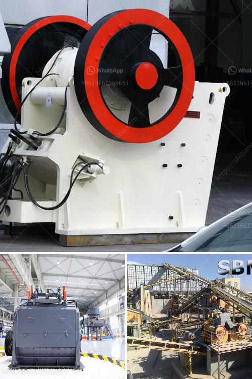

<h3>different size mining cone crusher</h3>
Mining cone crushers are used to break down raw ore into smaller pieces for further processing in various industries such as mining and construction. These crushers come in different sizes and capacities to meet the specific requirements of the operations.

Small-sized cone crushers are generally used for smaller crushing operations, usually requiring less than 200 tph production capacity. These crushers are often used in aggregate production, construction materials recycling, and mining operations where small rocks need to be reduced to smaller sizes.

Medium-sized cone crushers are commonly used for intermediate crushing, typically ranging from 200 to 500 tph. These crushers are ideal for producing high-quality products for construction, concrete, and asphalt applications. They can handle a wide range of materials, including hard and abrasive stones, and are suitable for both secondary and tertiary crushing.

Large-sized cone crushers are designed for high-volume crushing applications, with production capacities exceeding 500 tph. These crushers are used in large mining operations to reduce the size of ore blocks and facilitate further processing. They are capable of handling the toughest materials, such as granite, basalt, and iron ore, and are often used in primary crushing stages.

The size of a mining cone crusher determines its processing capacity and the final product size. Smaller crushers are suitable for crushing smaller rocks into finer particles, while larger crushers are used for larger rocks and more substantial production requirements.

When selecting a cone crusher, it is crucial to consider the required production capacity, feed size, and the hardness of the material. It is recommended to consult with experts or manufacturers to determine the most suitable size and capacity of a cone crusher for a specific operation.

In conclusion, mining cone crushers come in different sizes to meet the diverse needs of various industries. Small-sized crushers are suitable for smaller crushing operations, while medium-sized and large-sized crushers are ideal for higher production capacities. Choosing the right size cone crusher ensures efficient and effective crushing operations, resulting in high-quality products.
<h3>Contact us</h3><ul><li><strong>Whatsapp:&nbsp;<a href="https://wa.me/8613661969651">+8613661969651</a></strong></li><li><a href="https://swt.shibang-china.com/?git&amp;zhl&amp;different size mining cone crusher"><strong>Online Service(chat now)</strong></a></li></ul><h3>Related</h3><ul><li><a href='quarry crusher equipments for sale in ibadan nigeria.md'>quarry crusher equipments for sale in ibadan nigeria</a></li><li><a href='primary stone crusher.md'>primary stone crusher</a></li><li><a href='price of stone crusher in philippines.md'>price of stone crusher in philippines</a></li><li><a href='concrete crushers for recycling.md'>concrete crushers for recycling</a></li><li><a href='mill for grinding quartz.md'>mill for grinding quartz</a></li></ul>