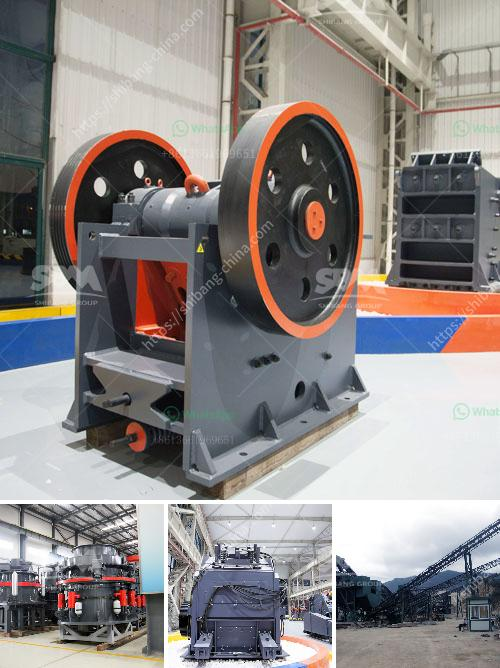

<h3>distributor belt conveyor di philippines</h3>
The industrial sector plays a crucial role in the growth and development of any economy. One of the key components of this sector is the conveyor system, which helps in the efficient movement of materials and products within a production facility. In the Philippines, distributor belt conveyors have become increasingly popular due to their versatility and effectiveness in various industries.

A distributor belt conveyor is a continuous conveying device that operates through a rotating belt. It is widely used in manufacturing plants, warehouses, distribution centers, and other industrial settings where the movement of materials is a critical part of the production process. These conveyors are designed to transport a wide range of products, including bulk materials, heavy-duty items, and even fragile goods.

One of the main advantages of using a distributor belt conveyor in the Philippines is its ability to significantly reduce labor costs and enhance production efficiency. With the installation of a conveyor system, manual handling of materials is greatly reduced, allowing workers to focus on more complex tasks. This not only improves overall productivity but also reduces the risk of workplace injuries and accidents.

Moreover, distributor belt conveyors in the Philippines are known for their durability and reliability. The robust design of these systems ensures that they can withstand heavy loads, extreme temperatures, and harsh environments. This makes them ideal for industries that require continuous operation, such as mining, construction, and manufacturing. Additionally, the low maintenance requirements of these conveyors make them a cost-effective solution for businesses of all sizes.

Another key benefit of distributor belt conveyors is their flexibility and adaptability. These systems can be customized to fit the specific needs of different industries and production processes. For instance, conveyors with adjustable heights and angles can accommodate various site layouts and plant configurations. Furthermore, specialized belts and accessories can be added to handle specific materials, such as food-grade belts for the food processing industry or heat-resistant belts for high-temperature applications.

In the Philippines, distributor belt conveyors have become an essential tool in industries such as mining, agriculture, logistics, and manufacturing. These conveyors not only streamline the production process but also improve overall operational efficiency. By investing in a reliable and efficient conveyor system, businesses can enjoy increased productivity, reduced labor costs, and improved workplace safety.

As the demand for distributor belt conveyors continues to grow in the Philippines, various companies have emerged as industry leaders in manufacturing and distributing these systems. These companies offer a wide range of conveyor solutions, including standard conveyors, modular conveyors, and custom-designed systems. Moreover, they provide comprehensive after-sales services, including installation, maintenance, and spare parts supply, ensuring the long-term reliability and performance of the conveyors.

In conclusion, distributor belt conveyors have revolutionized the industrial sector in the Philippines by offering a cost-effective, efficient, and reliable solution for material handling and transportation. As the demand for these systems continues to rise, businesses need to invest in high-quality conveyors from reputable distributors to ensure optimal performance and long-term success. By embracing this technology, the Philippine industrial sector is poised to experience significant growth and advancement in the coming years.
<h3>Contact us</h3><ul><li><strong>Whatsapp:&nbsp;<a href="https://wa.me/8613661969651">+8613661969651</a></strong></li><li><a href="https://swt.shibang-china.com/?git&amp;zhl&amp;distributor belt conveyor di philippines"><strong>Online Service(chat now)</strong></a></li></ul><h3>Related</h3><ul><li><a href='grinding mill made in germany.md'>grinding mill made in germany</a></li><li><a href='stone crusher conveyors belt price.md'>stone crusher conveyors belt price</a></li><li><a href='china mini rock crusher.md'>china mini rock crusher</a></li><li><a href='stone dust making machine.md'>stone dust making machine</a></li><li><a href='list of mini cement plants in gujarat.md'>list of mini cement plants in gujarat</a></li></ul>