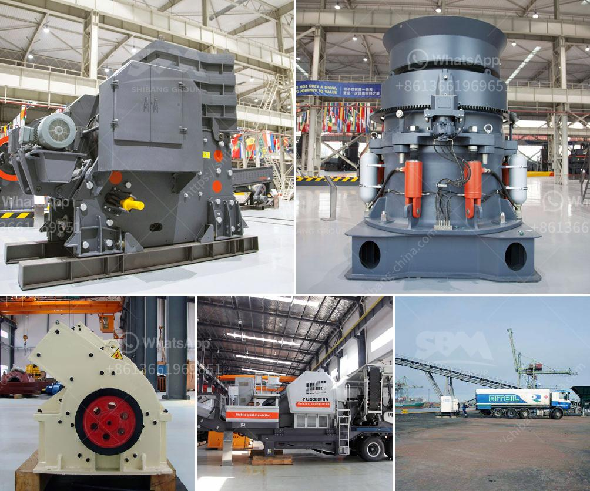

<h3>distributor pulverizer crusher indonesia</h3>
Distributor Pulverizer Crusher Indonesia: A Steady and Reliable Crushing and Pulverizing Machine in Indonesia

Crushing and pulverizing machines are used to break down various materials into smaller pieces for further processing. The machines are commonly used in construction, mining, and recycling industries. The introduction of crushers and pulverizers has improved the efficiency and productivity of these industries, making them more profitable and sustainable.

One prominent player in the crushing and pulverizing industry niche is PT. Marton Tekindo Abadi, a leading distributor of reliable and high-quality crushers and pulverizers in Indonesia. With more than 30 years of experience in this industry, PT. Marton Tekindo Abadi has gained a solid reputation as a trustworthy distributor.

The company offers a wide range of crushers and pulverizers suitable for various applications. One of their standout products is the pulverizer crusher, which is designed for efficient and reliable crushing of different materials. This machine can process rocks, ores, minerals, coal, and other materials into smaller pieces, making them easier to handle and process.

What sets PT. Marton Tekindo Abadi apart from other distributors is their commitment to providing excellent customer service. Their team of experts is readily available to offer advice and guidance on the best crushers and pulverizers suitable for specific applications. They can also provide technical support and assistance for optimal machine performance.

Another advantage of choosing PT. Marton Tekindo Abadi is their wide range of well-known brands. The company works with reputable manufacturers known for their high-quality and durable machines, ensuring customers receive top-notch products that last for years.

Furthermore, PT. Marton Tekindo Abadi has an extensive distribution network across Indonesia, enabling them to serve a wide range of customers efficiently. The company's dedicated team ensures timely delivery and reliable after-sales services, addressing any potential issues or concerns promptly.

In conclusion, PT. Marton Tekindo Abadi is a reliable distributor of pulverizer crushers in Indonesia, offering high-quality products suitable for various applications. With their extensive experience, excellent customer service, and wide distribution network, PT. Marton Tekindo Abadi is the go-to choice for industries looking for efficient, reliable, and long-lasting crushing and pulverizing machines.
<h3>Contact us</h3><ul><li><strong>Whatsapp:&nbsp;<a href="https://wa.me/8613661969651">+8613661969651</a></strong></li><li><a href="https://swt.shibang-china.com/?git&amp;zhl&amp;distributor pulverizer crusher indonesia"><strong>Online Service(chat now)</strong></a></li></ul><h3>Related</h3><ul><li><a href='jaw crusher for sale in ethiopia.md'>jaw crusher for sale in ethiopia</a></li><li><a href='vertical ball mills of india.md'>vertical ball mills of india</a></li><li><a href='manufacturer of industrial hammer mill.md'>manufacturer of industrial hammer mill</a></li><li><a href='sell stone crusher crushing plant feeder screen conveyors.md'>sell stone crusher crushing plant feeder screen conveyors</a></li><li><a href='crusher dust washing machines.md'>crusher dust washing machines</a></li></ul>