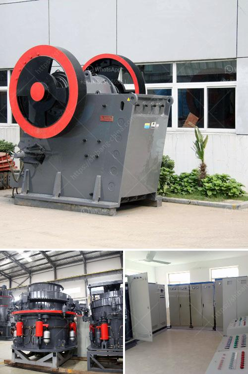

<h3>dolomite crusher machine</h3>
Dolomite is a calcium magnesium carbonate mineral that has many characteristics similar to calcite. In places where access to limestone is not available or more costly, dolomites are used as a substitute for limestone. Dolomite is also used in the production of float glass, as an ingredient in asphalt and concrete, and in agriculture as a soil conditioner and fertilizer.

To process dolomite, the first step is to extract the raw materials from the mine. The extracted dolomite is then transported to a jaw crusher for primary crushing. The crushed materials are sent to a cone crusher or impact crusher for secondary crushing. The finely crushed dolomite is screened by the vibrating screen and then conveyed by the belt conveyor to the impact crusher or cone crusher for further crushing.

The main equipment for dolomite crushing is the dolomite crusher machine. It consists of different types of dolomite crushers, including jaw crusher, cone crusher and impact crusher. In addition, these dolomite crushers can also be used in combination with other crushing equipment to process various materials.

The specific configuration of dolomite crushing line depends on the final product requirements, capacity and application in the industry. For example, in the construction industry, the final product size is required to be in the range of 0-5mm, 5-10mm, 10-20mm, and 20-40mm. Therefore, the dolomite crusher machine commonly consists of a jaw crusher, impact crusher or cone crusher, and vibrating screen.

The jaw crusher is used for the primary crushing of dolomite ore. It is also used in the dolomite crushing plant to reduce the size of dolomite for further processing. This crushing process is carried out in multiple stages, which reduces the size of the dolomite chunks to the required sizes. The crushed dolomite is then screened by the vibrating screen and conveyed to the impact crusher or cone crusher for further processing.

In conclusion, the dolomite crusher machine is often used in dolomite processing lines to process various raw materials. The dolomite crusher machine can process dolomite raw materials into required fineness and output size. Based on the information about dolomite, we know that the most commonly used dolomite crushers are jaw crusher, cone crusher, and impact crusher. The jaw crusher is used for primary crushing, and the impact crusher and cone crusher are used for secondary crushing. All these crusher machines are available from professional dolomite crushing machine manufacturers. Therefore, it is advisable to choose a suitable dolomite crusher machine according to the specific requirements of your projects.
<h3>Contact us</h3><ul><li><strong>Whatsapp:&nbsp;<a href="https://wa.me/8613661969651">+8613661969651</a></strong></li><li><a href="https://swt.shibang-china.com/?git&amp;zhl&amp;dolomite crusher machine"><strong>Online Service(chat now)</strong></a></li></ul><h3>Related</h3><ul><li><a href='kaolin processing plant south africa.md'>kaolin processing plant south africa</a></li><li><a href='rock crushing machine for concrete use.md'>rock crushing machine for concrete use</a></li><li><a href='ball mill manufacturers in india.md'>ball mill manufacturers in india</a></li><li><a href='how much cost to buildton cement plant.md'>how much cost to buildton cement plant</a></li><li><a href='coal washing plant in philippines south africa.md'>coal washing plant in philippines south africa</a></li></ul>