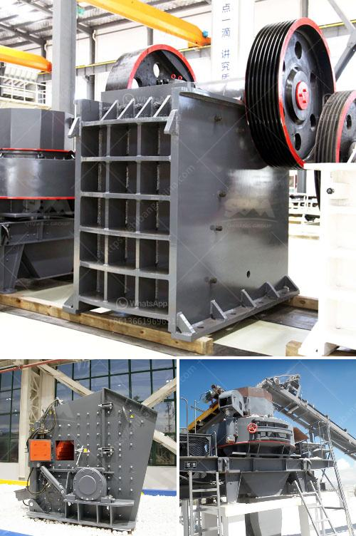

<h3>dolomite crusher manufacture plant</h3>
Dolomite is a carbonate mineral, widely used in various industries. It is an essential raw material for the manufacture of cement, steel, glass, and agricultural fertilizers. Dolomite crusher plants are used to process dolomite materials into artificial sand, building stone, and various metallurgical slags.

Dolomite crushing plant is the primary step for dolomite processing. The role of dolomite crushing equipment is to crush the large dolomite into small particles for further process. Dolomite crusher plant can crush the dolomite pieces into required sizes, such as 35mm, 20mm, 10mm, and so on.

According to the clients’ requirements, Zenith has designed different kinds of dolomite crushers for the customers. Typically, the dolomite crushing plant includes primary crushing, secondary crushing, and tertiary crushing. Jaw crusher is the primary crusher, which is used to crush raw dolomite into small particles. Cone crusher is the secondary or tertiary dolomite crusher, and VSI crusher (also called sand making machine) is used for the artificial sand production.

Dolomite crusher plant machine is used in dolomite crushing process. The complete dolomite crushing plant consists of dolomite crusher, vibrating feeder and vibrating screen. There are several types of stone crushers that can be used as dolomite crusher. Jaw crusher is the primary crusher that is used for primary crushing. It is the common dolomite crusher in dolomite mining. The range of final size of products can be 10-300 mm, and the capacity can be up to 100 ton/h.

Impact crusher is the secondary crusher. This crushing machine features reasonable structure, high productivity, easy operation and maintenance and safe performance. The most advantage of it is that the final particle is in good, cubic shape and without tensility and cranny. Cone crusher is the secondary or tertiary dolomite crusher. It is suitable for hard and mid-hard rocks and ores, such as iron ores, copper ores, limestone, quartz, granite, gritstone, etc. VSI crusher is also called sand making machine, it is the main machine for dolomite sand making.

Dolomite is crushed by the growing impact and ground by the grinding media in the rotating cylinder. Fine grinding of dolomite is carried out in the unit by means of attrition and compression of the limestone slurry, the dolomite feed and the slurry concentration. The particle size distribution of dolomite depends on the feed quality, the residence time in the crusher, and the air flow rate. The product fineness in turn is determined by the air flow rate, the feeder motor speed, and the classifier speed.

In conclusion, dolomite crusher machines are essential for dolomite crushing and processing plant. They can be used to process dolomite, such as jaw crusher, cone crusher, impact crusher and VSI crusher. If you are interested in them, please feel free to contact us at any time.
<h3>Contact us</h3><ul><li><strong>Whatsapp:&nbsp;<a href="https://wa.me/8613661969651">+8613661969651</a></strong></li><li><a href="https://swt.shibang-china.com/?git&amp;zhl&amp;dolomite crusher manufacture plant"><strong>Online Service(chat now)</strong></a></li></ul><h3>Related</h3><ul><li><a href='stone crusher sale in peru.md'>stone crusher sale in peru</a></li><li><a href='diesel compressors for sale in south africa.md'>diesel compressors for sale in south africa</a></li><li><a href='hydraulic conveyor belts.md'>hydraulic conveyor belts</a></li><li><a href='portable ballast crusher for sale.md'>portable ballast crusher for sale</a></li><li><a href='crushing plant aggregates in south africa.md'>crushing plant aggregates in south africa</a></li></ul>