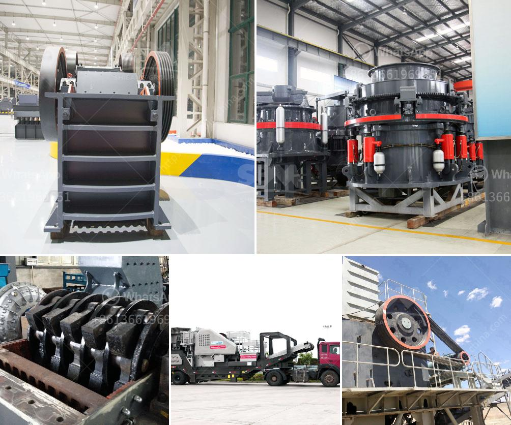

<h3>dolomite crusher price</h3>
When it comes to purchasing dolomite crushers, many buyers are only concerned about the brand and quality of the equipment. However, the price of the equipment is also an important factor to consider. With the economic development, competition in the market is fierce, and manufacturers will offer different prices based on different conditions. Let's take a look at the factors that affect the price of dolomite crusher and how to buy a cost-effective machine.

Firstly, the main factor affecting the price of dolomite crusher is the manufacturing cost. The manufacturing cost includes the cost of raw materials, labor, and electricity. Different manufacturers may use different materials and production techniques, resulting in different manufacturing costs.

Secondly, the capacity of the dolomite crusher also affects its price. The larger the capacity, the higher the price. Generally, the capacity of the dolomite crusher is different for different models. So, the larger the model, the higher the price.

Thirdly, the degree of automation of the dolomite crusher machine is also a key factor affecting the price. The more automated the equipment, the higher the investment cost, and the higher the price. However, automated equipment can greatly improve work efficiency and reduce labor costs in the long run.

Fourthly, the brand of the dolomite crusher also affects its price. There are many well-known dolomite crusher manufacturers on the market, each with its own unique advantages and reputation. In general, well-known brands tend to have higher prices, but they also offer better after-sales service and product quality assurance.

In addition to considering the above factors, buyers should also compare prices from different manufacturers to find the most cost-effective dolomite crusher. Here are a few tips for finding a cost-effective dolomite crusher:

1. Research and compare prices from multiple manufacturers. Don't rush into buying the first crusher you come across. Take your time to research and compare prices from different manufacturers to get the best deal.

2. Consider the after-sales service. A good after-sales service can save you a lot of trouble and money in the long run. Look for manufacturers that offer a comprehensive after-sales service, including maintenance, repair, and spare parts supply.

3. Read customer reviews. Customer reviews can provide valuable insights into the performance and price of dolomite crushers. Seek out reviews from trusted sources to help you make an informed decision.

4. Avoid overly cheap crushers. While lower prices may be tempting, excessively cheap crushers may be of low quality and have a shorter lifespan. It's important to strike a balance between price and quality.

In conclusion, the price of dolomite crusher is influenced by various factors, including manufacturing cost, capacity, degree of automation, and brand. Buyers should consider these factors and compare prices from different manufacturers to find a cost-effective machine. Remember to also consider after-sales service and read customer reviews for a well-rounded assessment.
<h3>Contact us</h3><ul><li><strong>Whatsapp:&nbsp;<a href="https://wa.me/8613661969651">+8613661969651</a></strong></li><li><a href="https://swt.shibang-china.com/?git&amp;zhl&amp;dolomite crusher price"><strong>Online Service(chat now)</strong></a></li></ul><h3>Related</h3><ul><li><a href='cost of mining process of calcium carbonate.md'>cost of mining process of calcium carbonate</a></li><li><a href='for sale used mobile jaw crusher australia.md'>for sale used mobile jaw crusher australia</a></li><li><a href='stone crushers in china.md'>stone crushers in china</a></li><li><a href='slag grinding plant.md'>slag grinding plant</a></li><li><a href='mobile crusher tph.md'>mobile crusher tph</a></li></ul>