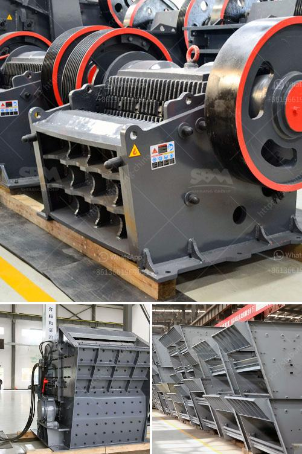

<h3>dolomite crushing machine pdf</h3>
Dolomite is a mineral composed of calcium magnesium carbonate, which is widely used in various industrial sectors. Dolomite can be used as a raw material for the production of cement, glass, ceramic products, and refractory materials, as well as metallurgical flux, chemical raw materials, and building materials.

To meet the demand for dolomite, it is necessary to carry out crushing and grinding operations on the dolomite ore. Dolomite crushing machine plays a crucial role in the process of dolomite processing. The crushing machine breaks the dolomite into small pieces that can be used for specific purposes.

The maintenance and repair of dolomite crushing machines should receive the utmost attention. The regular maintenance and repair include adjustment of the gap between the rotor of the impact crusher and the impact lining plate, replacement of wearing parts, regular inspection of the hammer, lining plate, bearing temperature, etc.

Replace badly worn parts in time to ensure normal operation of the machine. Pay attention to the tightness of the triangle belt, and adjust it appropriately to ensure the uniformity of the force on each triangle belt. Regularly add lubricating oil to the bearing parts of the dolomite crushing machine to ensure its normal operation.

The dolomite crushing machine/pdf download can be operated in the guidance of the technical team of our company. Only the maintenance and maintenance can make the crusher work properly and create higher economic benefits for the users. In addition, the crushing machine has the following characteristics:

Dolomite is a versatile mineral that can be used in various industrial sectors. The dolomite crushing machine-pdf download can help to ensure the long-term and efficient operation of the dolomite crushing machine in harsh conditions. Therefore, it is necessary to regularly maintain and repair the dolomite crushing machine to ensure its normal operation.

In addition, it is recommended to regularly download the latest PDF version of the crusher manual to ensure the continuity and efficiency in the maintenance work of the crusher.
<h3>Contact us</h3><ul><li><strong>Whatsapp:&nbsp;<a href="https://wa.me/8613661969651">+8613661969651</a></strong></li><li><a href="https://swt.shibang-china.com/?git&amp;zhl&amp;dolomite crushing machine pdf"><strong>Online Service(chat now)</strong></a></li></ul><h3>Related</h3><ul><li><a href='talc powder mill suppliers in china.md'>talc powder mill suppliers in china</a></li><li><a href='induatrial mill crusher supplier.md'>induatrial mill crusher supplier</a></li><li><a href='conveyor belt manufacturers in pakistan.md'>conveyor belt manufacturers in pakistan</a></li><li><a href='used iron ore equipment for sale.md'>used iron ore equipment for sale</a></li><li><a href='roller mill manufacturers in nigeria.md'>roller mill manufacturers in nigeria</a></li></ul>