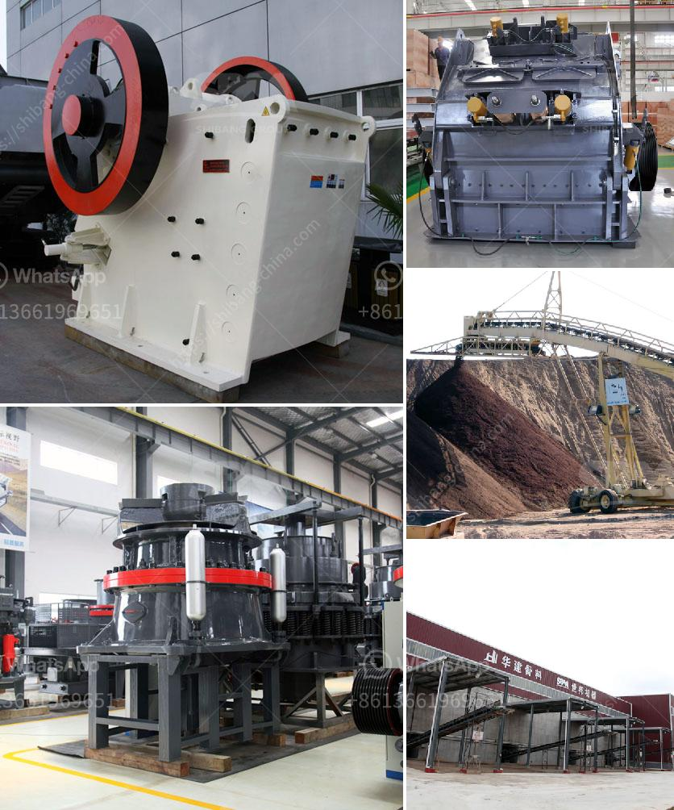

<h3>dolomite powder mill manufacturing process</h3>
Dolomite, a natural mineral composed of calcium magnesium carbonate, is commonly used in a variety of industrial applications. One of the most common uses of dolomite is in the production of powdered dolomite, which is used as a raw material in numerous industries including glass manufacturing, cement production, steelmaking, construction, agriculture, and more.

The process of manufacturing dolomite powder starts with crushing the mined dolomite rocks into small particles. A jaw crusher or gyratory crusher is usually used for initial crushing. The particles are then sent to a vibrating screen, where they are separated and divided into different sizes.

After the initial crushing, the dolomite particles are fed into a mill, where they are grinded into a fine powder. The mill used for grinding dolomite powder is a vertical mill or ball mill. The whole process of obtaining dolomite powder is divided into four stages: crushing, grinding, calcining, and packing.

Crushing: The first step in the manufacturing process involves crushing the dolomite rocks to smaller sizes. It can be done manually using a hammer, or with the help of a crusher.

Grinding: Once the dolomite particles reach the desired size, they are sent to a mill for grinding. The mill may use either vertical or horizontal mills, depending on the end use of the powder.

Calcining: After grinding, the dolomite powder is heated to a high temperature in a kiln or rotary calciner. This process, known as calcining, removes any impurities and enhances the desired properties of the dolomite powder.

Packing: The final stage involves packaging the dolomite powder into bags, containers, or bulk storage. The powder is carefully measured and packed to ensure quality control and proper storage.

In conclusion, the manufacturing process of dolomite powder involves crushing, grinding, calcining, and packing. This versatile mineral is widely used in various industries due to its unique properties. The efficient manufacturing process ensures the production of high-quality dolomite powder that meets the specific requirements of different industries.
<h3>Contact us</h3><ul><li><strong>Whatsapp:&nbsp;<a href="https://wa.me/8613661969651">+8613661969651</a></strong></li><li><a href="https://swt.shibang-china.com/?git&amp;zhl&amp;dolomite powder mill manufacturing process"><strong>Online Service(chat now)</strong></a></li></ul><h3>Related</h3><ul><li><a href='crusher machine in bhutan.md'>crusher machine in bhutan</a></li><li><a href='silica sand washing plant.md'>silica sand washing plant</a></li><li><a href='hammer crusher machine in malaysia.md'>hammer crusher machine in malaysia</a></li><li><a href='cost per hour mobile crusher.md'>cost per hour mobile crusher</a></li><li><a href='lippman jaw crusher for sale.md'>lippman jaw crusher for sale</a></li></ul>