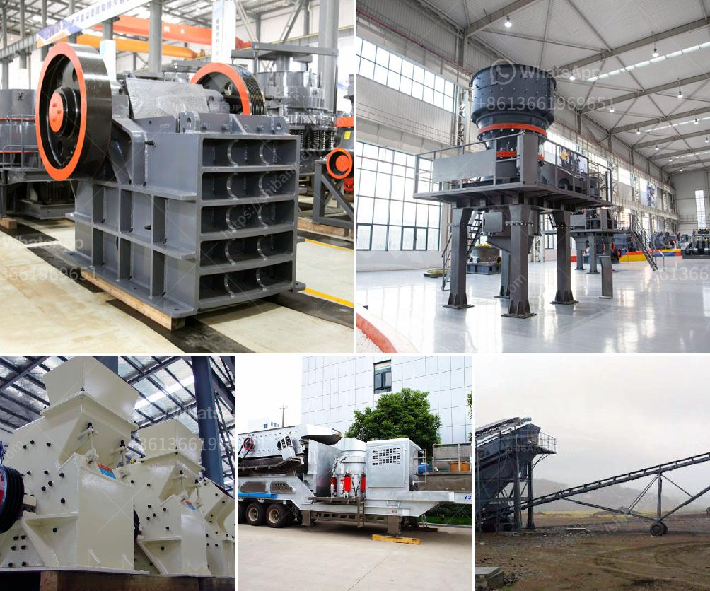

<h3>dolomite powder producing machinery</h3>
Dolomite is a natural mineral that is predominantly composed of calcium magnesium carbonate. It is widely used in various industries such as construction, agriculture, and manufacturing. To meet the growing demand for dolomite, the mining industry is turning towards efficient dolomite powder producing machinery.

Dolomite powder is obtained by processing dolomite rock through various crushing, grinding, and screening operations. The dolomite powder production process starts with the extraction of dolomite ore from the mines. After extraction, dolomite ore is crushed and screened to remove impurities and produce particles of desired specification. The crushed dolomite ore is then ground to a fine powder in ball mills and other grinding mills.

The ground dolomite powder is then classified and dried using rotary kilns or air classifiers. This drying process removes moisture and ensures the uniformity of the particle size distribution. The dried dolomite powder is stored in silos or packed in bags for transportation to various industries.

To produce dolomite powder efficiently, specialized machinery is required. The selection of machinery depends on various factors such as the size of the dolomite ore, the required particle size of the final product, and the capacity of the production plant. Some common machinery used in dolomite powder production includes jaw crushers, hammer mills, rotary kilns, impact crushers, air classifiers, and packing machines.

Jaw crushers are used to break down large-sized dolomite rocks into small particles. Hammer mills are used to further crush the dolomite particles into a fine powder. Rotary kilns are used for the drying and calcination of dolomite ore. Impact crushers are used to grind and reduce the size of dolomite ore. Air classifiers are used to separate fine particles from coarse particles. Packing machines are used to pack the dolomite powder into bags or bulk containers for transportation.

In recent years, there have been advancements in dolomite powder producing machinery. These advancements include automation, improved efficiency, and reduced energy consumption. For example, modern hammer mills are equipped with advanced control systems that optimize energy consumption and reduce downtime. Rotary kilns are now equipped with advanced heat recovery systems that minimize heat loss and maximize fuel efficiency.

The development of eco-friendly dolomite powder producing machinery is also gaining importance. Manufacturers are focusing on reducing the environmental impact of dolomite powder production. This includes the use of cleaner energy sources, such as solar and wind power, and the implementation of pollution control technologies.

In conclusion, dolomite powder producing machinery plays a crucial role in the mining industry. With the increasing demand for dolomite, the industry is constantly innovating to develop machinery that is more efficient, eco-friendly, and cost-effective. With advancements in technology, it is expected that the production of dolomite powder will become even more efficient in the future.
<h3>Contact us</h3><ul><li><strong>Whatsapp:&nbsp;<a href="https://wa.me/8613661969651">+8613661969651</a></strong></li><li><a href="https://swt.shibang-china.com/?git&amp;zhl&amp;dolomite powder producing machinery"><strong>Online Service(chat now)</strong></a></li></ul><h3>Related</h3><ul><li><a href='mining process of calcium carbonate in south africa.md'>mining process of calcium carbonate in south africa</a></li><li><a href='processing plan for feldspar ore.md'>processing plan for feldspar ore</a></li><li><a href='washing plant suppliers in mozambique.md'>washing plant suppliers in mozambique</a></li><li><a href='quartz silica old plant sale at telgana.md'>quartz silica old plant sale at telgana</a></li><li><a href='granite crushing companies.md'>granite crushing companies</a></li></ul>