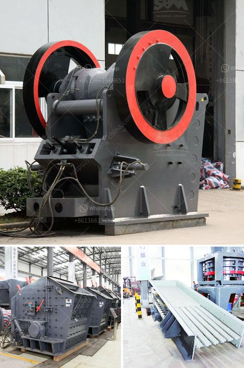

<h3>double toggle jaw crushers</h3>
Double toggle jaw crushers are commonly used in mines due to their ability to crush tough and abrasive materials. The oscillating motion of the swing jaw is caused by the vertical motion of the pitman. The pitman moves up and down slightly, which causes the swing jaw to oscillate. The swing jaw creates a pushing motion against the fixed jaw, which results in crushing the material. This mechanical pressure is achieved by the two jaws of the crusher. One jaw is fixed while the other reciprocates.

A double toggle jaw crusher is much larger, heavier, more moving parts and lower throughput than modern single toggle jaw crushers. The lower throughput statement is a bit misleading because it’s partially attributed to the type of bearings they have versus modern crushers, so if one was to upgrade the bearings, throughput could be closer to that of a modern jaw. Anyway, double toggle jaw crushers have only one toggle plate in the crushing process, which has two functions. Firstly, it moves the swing jaw towards the fixed jaw to exert a compressive force against the materials being crushed. The moving jaw compresses the material against the stationary jaw. Secondly, it helps in the discharge of the crushed material as the single toggle would achieve.

These crushers have the advantage of a high reduction ratio, but have a tendency to produce elongated particles. Also, they are more expensive than single toggle crushers and have a higher capital cost.

In a double toggle jaw crusher, the eccentric is located behind the swinging jaw. This has two main effects, – it keeps the eccentric out of harms way when rock is being loaded and the other effect is a limited plane of motion for the moving jaw which contributes to its lack of productivity.

Another difference between the double toggle jaw crushers and the single ones is the position of the eccentric. In a double jaw crusher, the eccentric is found behind the swinging jaw. That helps protect the eccentric from any further damages.

Double toggle jaw crushers are a great choice for abrasive and high clay containing rocks. They are more expensive but have low maintenance costs.

Double toggle jaw crushers usually have a bigger reduction ratio, compared to other crushers and their jaw plates are made of different kinds of manganese steel. This type of jaw crushers tends to be used for mining operations where primary crushing is performed with larger raw materials. However, the double toggle jaw crushers have more advantages and are commonly used in mines due to their ability to crush tough and abrasive materials.

In conclusion, double toggle jaw crushers are a reliable and safe option to reduce the size of hard rocks and ore. However, they require advanced machinery and additional maintenance to operate effectively. Therefore, it is essential to understand the pros and cons of the double toggle jaw crusher before choosing it for your crushing needs.
<h3>Contact us</h3><ul><li><strong>Whatsapp:&nbsp;<a href="https://wa.me/8613661969651">+8613661969651</a></strong></li><li><a href="https://swt.shibang-china.com/?git&amp;zhl&amp;double toggle jaw crushers"><strong>Online Service(chat now)</strong></a></li></ul><h3>Related</h3><ul><li><a href='ultra conveyor belts usa.md'>ultra conveyor belts usa</a></li><li><a href='indonesia raymond mill import agent.md'>indonesia raymond mill import agent</a></li><li><a href='shaft hammer crusher hds.md'>shaft hammer crusher hds</a></li><li><a href='mini cement plant project report.md'>mini cement plant project report</a></li><li><a href='hammer mill prices.md'>hammer mill prices</a></li></ul>