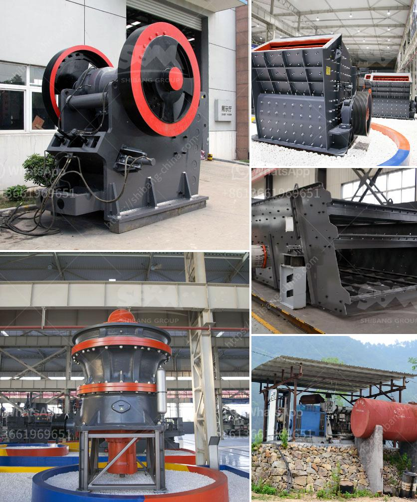

<h3>dry ball mill vs wet ball mill</h3>
When it comes to grinding and milling, the two most common techniques are dry and wet grinding. The choice between these two methods is influenced by a wide range of factors, such as the nature of the starting material, the desired final product, and the cost of production. In this article, we will explore the differences between dry ball milling and wet ball milling.

The process of grinding materials using a ball mill is essential in many industries, especially in the mineral processing sector. Both the dry and wet processes have their advantages and disadvantages, making the decision between the two challenging.

In dry grinding, the material is fed through the mill into a rotating drum filled with grinding media. As the drum rotates, the grinding media cascades and impacts the material, resulting in reduced particle size. Dry grinding is generally faster and more efficient than wet grinding, as it uses friction to break down the particles. It is also less messy, making it suitable for grinding materials that are sensitive to moisture.

In wet grinding, the material is mixed with water or other liquid to form a slurry. The slurry is then fed into a rotating drum filled with grinding media. The liquid serves two purposes: lubricating the grinding media and assisting in particle dispersion. Wet grinding is particularly useful for materials that are difficult to grind or those that require a finer particle size. It is also commonly used in the paint and coating industry, where the addition of liquid helps achieve a smoother finish.

Despite the advantages of each method, there are some drawbacks to consider. Dry grinding may result in more dust and heat generated during the process, which can be a safety concern and require additional ventilation. On the other hand, wet grinding may require more energy and maintenance to remove excess moisture from the final product.

In conclusion, whether to choose dry ball milling or wet ball milling depends on the specific characteristics of the material being processed, the desired final product, and the cost considerations. Both methods have their advantages and disadvantages, and the decision should be made based on a thorough evaluation of these factors.
<h3>Contact us</h3><ul><li><strong>Whatsapp:&nbsp;<a href="https://wa.me/8613661969651">+8613661969651</a></strong></li><li><a href="https://swt.shibang-china.com/?git&amp;zhl&amp;dry ball mill vs wet ball mill"><strong>Online Service(chat now)</strong></a></li></ul><h3>Related</h3><ul><li><a href='stone crushers in china.md'>stone crushers in china</a></li><li><a href='crushed stones aggregate in uganda.md'>crushed stones aggregate in uganda</a></li><li><a href='machinery for hydrated lime powder.md'>machinery for hydrated lime powder</a></li><li><a href='limestone crusher for sale.md'>limestone crusher for sale</a></li><li><a href='copper ore ball mill.md'>copper ore ball mill</a></li></ul>