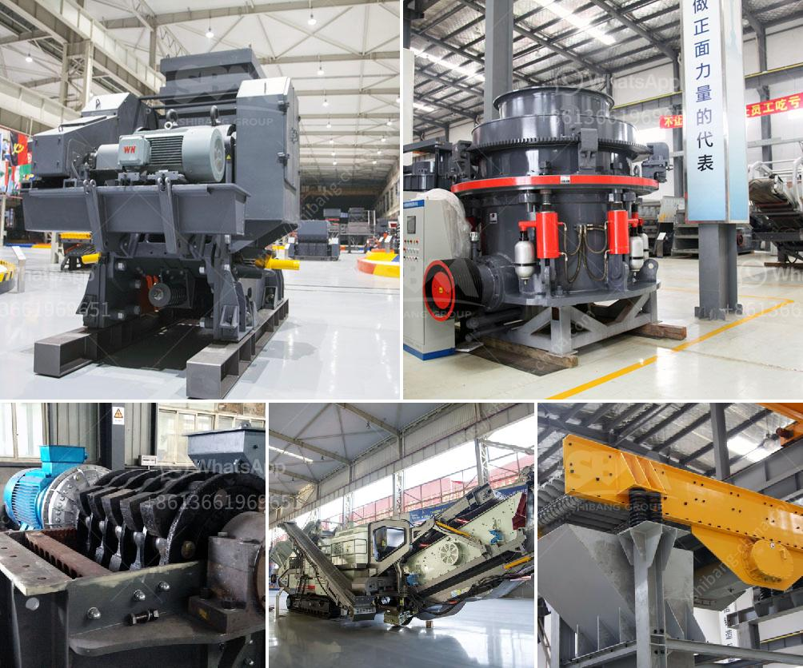

<h3>dry ball milling process</h3>
Dry ball milling is a grinding method that uses balls with a large diameter ranging from 5mm to 25mm to grind materials into fine powder. From the perspective of the grinding process, the ball mill process is very complicated due to the complicated nature of the interface between the ore particles and the steel balls. During the grinding process, the steel balls collide with each other and the ore particles, causing a range of physical and chemical changes to occur.

The dry ball milling process is carried out in a horizontal cylindrical chamber, with the steel balls becoming the grinding media. The chamber is filled with balls and ore particles, and the balls revolve around the chamber while the chamber rotates to produce a centrifugal force. The ore particles are subjected to an impact force that breaks them down into smaller particles.

One of the main advantages of dry ball milling is that it is highly efficient and allows for the production of fine particles. It is especially suitable for grinding materials that are brittle or have a low moisture content. The dry ball milling process can be used to control the size distribution of particles, create a fine powder, or nanoscale particles.

In addition to its efficiency, dry ball milling also offers other benefits. For example, it is a relatively simple process that does not require complex equipment or machinery. It is also energy efficient, as the grinding process does not involve the use of water or other fluids, which helps to reduce costs and decrease the environmental impact.

However, there are also some limitations to the dry ball milling process. One limitation is that it can only process materials with a low moisture content. If the moisture content of the material is too high, it can cause the balls to stick together, resulting in inefficient grinding and decreased productivity. Additionally, the dry ball milling process is not suitable for materials that are prone to oxidation or combustion, as it does not provide the cooling effect of a liquid medium.

To overcome these limitations, various modifications and improvements have been made to the dry ball milling process. For example, adding a small amount of liquid, such as water or a solvent, can improve the efficiency and reduce the risk of ball sticking. Similarly, the use of grinding aids or additives can also enhance the grinding performance and increase productivity.

In conclusion, dry ball milling is a highly efficient and versatile process that can be used to grind materials into fine powder or nanoscale particles. It offers numerous advantages, including its simplicity, energy efficiency, and the ability to control particle size distribution. However, it also has limitations, such as its inability to process materials with a high moisture content. Despite these limitations, ongoing research and development efforts are focused on improving and optimizing the dry ball milling process to make it even more effective and versatile.
<h3>Contact us</h3><ul><li><strong>Whatsapp:&nbsp;<a href="https://wa.me/8613661969651">+8613661969651</a></strong></li><li><a href="https://swt.shibang-china.com/?git&amp;zhl&amp;dry ball milling process"><strong>Online Service(chat now)</strong></a></li></ul><h3>Related</h3><ul><li><a href='how profitable is tipping truck business in nigeria.md'>how profitable is tipping truck business in nigeria</a></li><li><a href='small scale gold refinery plant equipments.md'>small scale gold refinery plant equipments</a></li><li><a href='gypsum board manufacturing plant cost india.md'>gypsum board manufacturing plant cost india</a></li><li><a href='ball mill pakistan for sale.md'>ball mill pakistan for sale</a></li><li><a href='china vertical roller mill prices.md'>china vertical roller mill prices</a></li></ul>