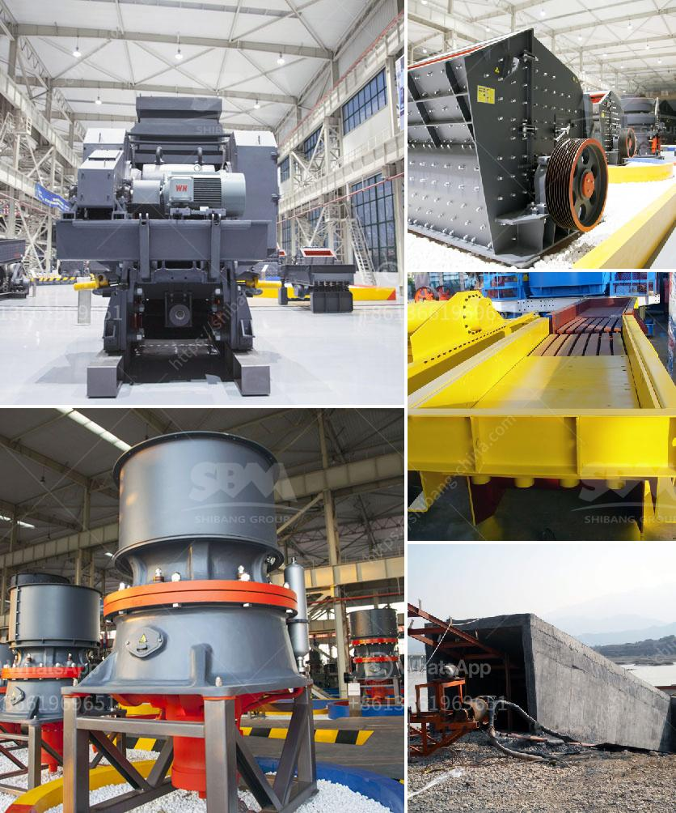

<h3>dry grinders mills</h3>
Dry grinders mills have become a staple in modern kitchens due to their versatility and ease of use. These compact appliances are designed to grind various ingredients, transforming them into finer particles or powders. From coffee beans to spices, dry grinders mills offer a quick and efficient way to prepare ingredients for cooking or brewing.

One of the key benefits of dry grinders mills is their powerful motor, which allows for efficient grinding of even the toughest ingredients. Many models feature high-speed motors that can grind spices, nuts, or coffee beans in seconds, saving valuable time and effort in the kitchen. Whether you need a coarse grind for spices or a fine powder for baking, these mills provide precise control over the texture of the ingredients.

Dry grinders mills are also incredibly user-friendly. Most models come with simple controls, usually a single button or knob, making them suitable for users of all skill levels. They are also designed with safety in mind, often featuring a lid lock that prevents the grinder from operating if the lid is not securely closed. This feature ensures that users can safely grind without worrying about any accidents.

Furthermore, dry grinders mills are relatively compact, making them ideal for kitchens with limited countertop or storage space. Their sleek and compact design allows for easy storage when not in use, ensuring they don't clutter up the kitchen. Many models also come with detachable components, making them easy to clean after use.

In conclusion, dry grinders mills are an essential kitchen appliance that provides convenience and versatility. Their efficient grinding capabilities and user-friendly design make them a valuable addition to any kitchen. From grinding spices for flavorful curries to preparing fresh coffee grounds for a perfect cup of joe, these mills are sure to simplify your cooking and brewing processes. So, why not invest in a dry grinder mill today and elevate your culinary endeavors?
<h3>Contact us</h3><ul><li><strong>Whatsapp:&nbsp;<a href="https://wa.me/8613661969651">+8613661969651</a></strong></li><li><a href="https://swt.shibang-china.com/?git&amp;zhl&amp;dry grinders mills"><strong>Online Service(chat now)</strong></a></li></ul><h3>Related</h3><ul><li><a href='jaw crusher manufactures in saudi.md'>jaw crusher manufactures in saudi</a></li><li><a href='slag crusher makers in india.md'>slag crusher makers in india</a></li><li><a href='washing plant suppliers in mozambique.md'>washing plant suppliers in mozambique</a></li><li><a href='cost of limestone grinding machine.md'>cost of limestone grinding machine</a></li><li><a href='crusher plant equipment supplier in saudi arabia.md'>crusher plant equipment supplier in saudi arabia</a></li></ul>