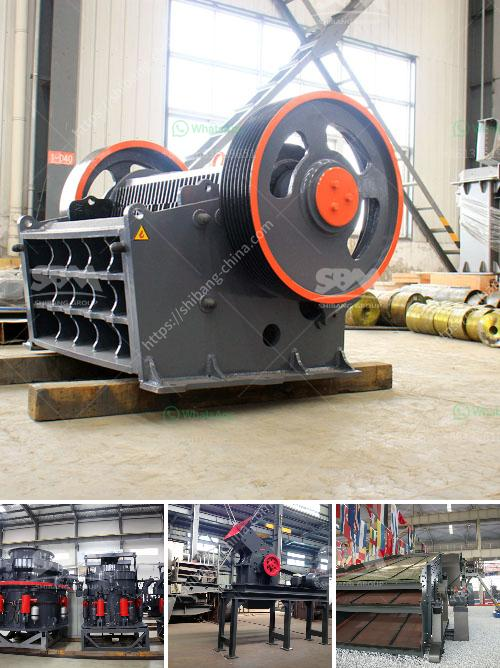

<h3>dust reduction system for stone crusher plant</h3>
Dust accumulation is a major source of concern for a plant owner and operator. Dust, especially in the case of crushing plants, is a reality that operators must contend with. It can be a nuisance or even a potential health hazard, affecting both the employees working in the plant and the surrounding community.

To tackle dust accumulation in stone crusher plants, experts recommend the usage of well-designed suction hoods at the points where dust is generated (e.g., hoppers, conveyers, sieves, and screens). The hoods effectively trap the dust and prevent it from escaping into the air.

Additionally, implementing a dust suppression system can significantly reduce the amount of dust generated. These systems utilize water sprays or mist cannons to suppress the dust particles, preventing their dispersion into the environment. The water sprays can be strategically positioned at key dust generation points, ensuring maximum control and coverage.

Another effective dust reduction measure is the installation of dust curtains or barriers. These physical barriers prevent the dust from spreading to adjacent areas, minimizing its impact on the surroundings. These curtains can be made from PVC or other materials that can withstand the harsh conditions in a crushing plant.

Regular cleaning and maintenance of the equipment are also crucial for dust reduction. The accumulation of dust on machinery not only increases the risk of breakdowns but also provides additional surfaces from which dust can become airborne. Implementing a strict cleaning routine ensures that dust is regularly removed, reducing the chances of it being dispersed in the plant.

Moreover, it's important to educate employees about the risks associated with dust exposure and provide them with personal protective equipment (PPE). This can include masks, goggles, and other gear that can prevent the inhalation or contact with dust particles.

Lastly, implementing an effective ventilation system is vital for maintaining a healthy working environment. Proper air circulation can help remove dust particles and improve air quality within the plant.

In conclusion, controlling and reducing dust emissions in a stone crusher plant is not an impossible task. With the right strategies in place, any operator can minimize the risks associated with dust accumulation and ensure a safe and healthy working environment for all. By implementing a combination of dust reduction measures such as suction hoods, dust suppression systems, barriers, regular cleaning, employee education, and proper ventilation, plant operators can effectively tackle the issue of dust in their facilities.
<h3>Contact us</h3><ul><li><strong>Whatsapp:&nbsp;<a href="https://wa.me/8613661969651">+8613661969651</a></strong></li><li><a href="https://swt.shibang-china.com/?git&amp;zhl&amp;dust reduction system for stone crusher plant"><strong>Online Service(chat now)</strong></a></li></ul><h3>Related</h3><ul><li><a href='quartz mining equipments.md'>quartz mining equipments</a></li><li><a href='raymod 5 roller mill for pulverizing unit.md'>raymod 5 roller mill for pulverizing unit</a></li><li><a href='small scale gold processing machines price list.md'>small scale gold processing machines price list</a></li><li><a href='stone crusher plant manufacturers china.md'>stone crusher plant manufacturers china</a></li><li><a href='cone crusher in the philippines.md'>cone crusher in the philippines</a></li></ul>