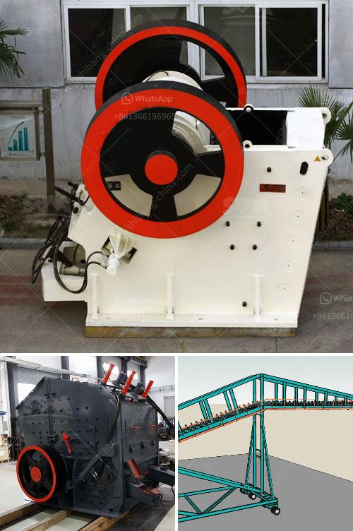

<h3>eco stone crusher</h3>
With increasing pollution levels across the world, industries and individuals alike are stepping up efforts to curb pollution and mitigate its effects. The stone crushing industry is a major contributor to pollution, impacting the lives of both workers and local communities adversely. To protect the environment, developers are now embracing advanced technology to create eco-friendly stone crushers that reduce hazardous emissions and provide a sustainable alternative.

An eco stone crusher, also known as a rock crusher, is inherently eco-friendly. It features a diesel engine with a emission control system, making it more environmentally friendly. In addition, it has a modular design and comes in a compact size, enabling it to fit into tight spaces without compromising its performance.

These eco stone crushers are capable of crushing a variety of rock types, including granite, limestone, and concrete, effectively minimizing the waste generated from construction projects and reducing the need for new raw materials. By using recycled materials, these crushers aid in conserving natural resources and reducing carbon emissions.

Furthermore, eco stone crushers have significantly lower noise levels than traditional crushers, ensuring a peaceful environment for nearby residents. This is achieved through the use of advanced noise reduction technologies, such as noise-damping materials and noise-cancelling systems.

The eco stone crusher also incorporates advanced dust suppression systems, preventing the release of harmful particulate matter into the air. This significantly improves air quality, reducing the risk of respiratory problems for workers and nearby communities.

Overall, eco stone crushers not only reduce pollution levels but also improve the sustainability of construction projects. They offer a cost-effective and environmentally-friendly solution by reducing the need for new raw materials, minimizing waste, and ensuring worker and community safety.

As the demand for eco-friendly crushers grows, the industry is witnessing continuous innovation and improvements in design and performance. Developers are working towards making these crushers even more efficient, powerful, and eco-friendly, ensuring a sustainable future for both the environment and the construction industry.
<h3>Contact us</h3><ul><li><strong>Whatsapp:&nbsp;<a href="https://wa.me/8613661969651">+8613661969651</a></strong></li><li><a href="https://swt.shibang-china.com/?git&amp;zhl&amp;eco stone crusher"><strong>Online Service(chat now)</strong></a></li></ul><h3>Related</h3><ul><li><a href='puzzolana 50 tph crusher plant prices.md'>puzzolana 50 tph crusher plant prices</a></li><li><a href='mobile crusher for rent in uae.md'>mobile crusher for rent in uae</a></li><li><a href='used 34 ssi shredder united states.md'>used 34 ssi shredder united states</a></li><li><a href='picture of silica sand process plant.md'>picture of silica sand process plant</a></li><li><a href='graphite powder making machine.md'>graphite powder making machine</a></li></ul>