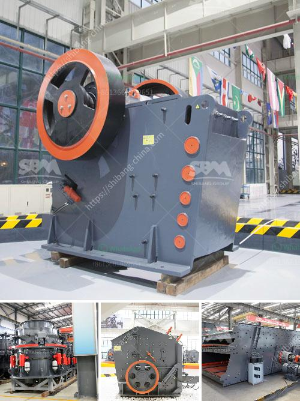

<h3>ecuador balls for crushing mill</h3>
Ecuador, a vibrant South American country, boasts a rich historical and cultural heritage. Among its many treasures, one intriguing local specialty has recently garnered attention - Ecuadorian balls for crushing mills. These spherical objects, traditionally made from stone or metal, play an integral role in a process crucial to several industries. In this article, we delve into the significance of these Ecuadorian balls, exploring their origins, applications, and the communities behind their production.

The history of Ecuadorian balls for crushing mills traces back centuries, aligning with the nation's long-standing agricultural and industrial traditions. Initially, the indigenous communities of Ecuador used river stones as crushing tools for grain, ore, and other raw materials. Over time, as the demand for more efficient processing methods grew, these communities began crafting specialized balls using carved stone or metal alloys.

The primary function of Ecuadorian balls for crushing mills is to enhance the efficiency of processing raw materials, a vital component within various industries. These industries range from traditional agricultural practices, such as milling grains and crushing sugarcane, to mining and other mineral extraction processes. The use of these balls helps to break down raw materials into smaller, more manageable pieces, enabling subsequent processing stages.

The production of Ecuadorian balls for crushing mills is an art form embraced by skilled artisans across Ecuador's indigenous communities. These craftsmen use their expertise, passed down through generations, to create each ball meticulously. The beauty and precision of the carved designs reflect the pride and dedication found within these communities. Some balls showcase traditional symbols and motifs, highlighting the rich cultural heritage of Ecuador.

The production of Ecuadorian balls for crushing mills not only preserves cultural practices but also has a positive socioeconomic impact. The craftsmen, often members of marginalized communities, gain sustainable livelihoods through this specialized art. Additionally, the demand for these artisanal products boosts local economies and promotes tourism as visitors appreciate the craftsmanship and purchase these unique creations as souvenirs.

Ecuadorian balls for crushing mills represent an intriguing blend of tradition, efficiency, and artistry. As vessels of historical significance and useful tools, they underscore Ecuador's agricultural and industrial roots. The continued production and appreciation of these balls contribute to the preservation of local cultural heritage while uplifting indigenous communities economically.
<h3>Contact us</h3><ul><li><strong>Whatsapp:&nbsp;<a href="https://wa.me/8613661969651">+8613661969651</a></strong></li><li><a href="https://swt.shibang-china.com/?git&amp;zhl&amp;ecuador balls for crushing mill"><strong>Online Service(chat now)</strong></a></li></ul><h3>Related</h3><ul><li><a href='saudi arabia crusher plant.md'>saudi arabia crusher plant</a></li><li><a href='rock grinding mill price in india.md'>rock grinding mill price in india</a></li><li><a href='lates hammer mill.md'>lates hammer mill</a></li><li><a href='kaolin processing plant south africa.md'>kaolin processing plant south africa</a></li><li><a href='hammer mill 200 mesh.md'>hammer mill 200 mesh</a></li></ul>