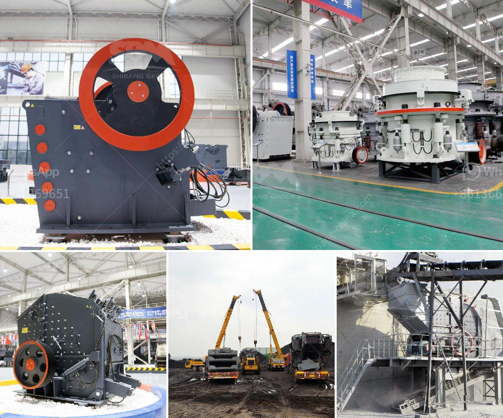

<h3>egypt crusher suppliers manufacturers</h3>
Egypt, the land of Pharaohs, is a country that never fails to awe the world with its magnificent ancient wonders and rich cultural heritage. Over the years, Egypt has also made significant strides in its infrastructure development, attracting tourists and investors alike. The country's construction industry plays a crucial role in shaping its modern landscape, and the backbone of this industry is the numerous crusher suppliers and manufacturers.

Crushers are heavy-duty machines designed to break large rocks into smaller, more manageable pieces. They are indispensable in the construction industry, where they are used to process various raw materials for construction projects, including concrete, asphalt, and stones. Egypt, with its thriving construction sector, heavily relies on crushers to meet its material demands.

A wide range of Egyptian crusher suppliers and manufacturers operate in the country, providing high-quality and efficient crushing machines. They have been catering to the country's construction needs for years, contributing to the growth and development of the industry. These suppliers and manufacturers offer a diverse range of crushers, catering to different requirements and budgets.

One of the leading crusher manufacturers in Egypt is XXXX. They have been providing top-quality products and services to the construction industry for several years. Their crushers are known for their exceptional performance, durability, and reliability. From jaw crushers to impact crushers and cone crushers, XXXX offers a comprehensive range of crushing machines.

Another prominent supplier in Egypt is YYYY. They specialize in manufacturing crushers that are suitable for both primary and secondary crushing applications. Their products are known for their superior performance, ease of operation, and low maintenance requirements. YYYY's crushers are trusted by contractors and builders across Egypt for their efficiency in crushing various materials.

In addition to these manufacturers, Egypt is home to many other crusher suppliers. These include ZZZZ, a renowned supplier of portable crushers, and WWWW, specializing in stationary crushers. These suppliers offer a wide range of crushers, ensuring that the construction industry has access to the latest and most advanced crushing technology.

The crusher suppliers and manufacturers in Egypt are not only focused on delivering high-quality products but also providing excellent after-sales services. They understand the importance of supporting their customers throughout the lifespan of their crushers. Whether it is spare parts, maintenance, or technical assistance, these suppliers go the extra mile to ensure customer satisfaction.

The presence of reliable crusher suppliers and manufacturers in Egypt has had a profound impact on the country's construction industry. They have provided the necessary equipment to streamline construction processes and efficiently meet project deadlines. Moreover, their high-quality products have improved the overall durability and quality of the buildings and infrastructure in Egypt.

As Egypt continues to embrace development and attract investments, the crusher suppliers and manufacturers will play a critical role in supporting the growth of the construction industry. Their commitment to excellence, innovation, and customer satisfaction will continue to drive the industry forward, making Egypt a powerhouse in the global construction arena.

In conclusion, Egypt's construction industry heavily relies on crusher suppliers and manufacturers to meet its material requirements. These suppliers offer a diverse range of crushers, catering to various construction needs. Their high-quality products and excellent after-sales services have transformed Egypt into a major player in the global construction industry. With their continued commitment to excellence, they will contribute to the continued growth and development of Egypt's infrastructure for years to come.
<h3>Contact us</h3><ul><li><strong>Whatsapp:&nbsp;<a href="https://wa.me/8613661969651">+8613661969651</a></strong></li><li><a href="https://swt.shibang-china.com/?git&amp;zhl&amp;egypt crusher suppliers manufacturers"><strong>Online Service(chat now)</strong></a></li></ul><h3>Related</h3><ul><li><a href='high pressure micro powder grinder in india.md'>high pressure micro powder grinder in india</a></li><li><a href='wet grinding mill china.md'>wet grinding mill china</a></li><li><a href='mobile stone crusher price philippines.md'>mobile stone crusher price philippines</a></li><li><a href='business plan small scale gold mining.md'>business plan small scale gold mining</a></li><li><a href='stone crusher manufacturers in ludhiana.md'>stone crusher manufacturers in ludhiana</a></li></ul>