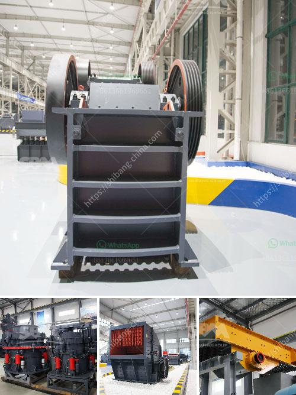

<h3>enquiry about rock crusher</h3>
In today's industrial world, one of the crucial machines that enable the construction and mining industries to thrive is the rock crusher. A rock crusher is a machine that reduces large rocks into smaller pieces by processing them through a crushing action. This type of machinery is used to break down various types of rocks, ranging from granite to limestone, into smaller sizes to be used in construction, mining, and other related industries.

When it comes to purchasing a rock crusher, it is essential to conduct a thorough enquiry to ensure the machine you choose will meet your specific needs. Here are a few important factors to consider when making an enquiry about a rock crusher:

1. Capacity: The first thing to determine is the desired capacity of the rock crusher. How much material do you need to process daily or weekly? By understanding your production requirements, you can select a rock crusher that has the capacity to handle the volume of material you need to process efficiently.

2. Power source: Rock crushers can be powered by electricity, diesel fuel, or even a combination of both. If you have access to a reliable power source, an electric-powered rock crusher might be the most convenient option. However, for locations without electricity or for portable applications, a diesel-powered rock crusher could be a better fit.

3. Mobility: If your project requires the rock crusher to be moved frequently or if you need to transport it to different locations, consider purchasing a portable rock crusher. These machines are designed to be easily transportable and can be set up quickly at new sites. On the other hand, if the rock crusher is intended to stay in one place, a stationary model might be more suitable.

4. Maintenance and serviceability: Like any machine, a rock crusher requires regular maintenance to ensure optimal performance. Inquire about the availability of spare parts and the ease of servicing the machine. It is also important to consider the manufacturer's reputation for after-sales service, as prompt and reliable support can reduce downtime and keep your operations running smoothly.

5. Price and budget: Lastly, but certainly not least, consider your budget when enquiring about a rock crusher. Different models and brands come at varying price points, so it is crucial to find a balance between cost and quality. Avoid compromising on quality just to save a few bucks, as a reliable and durable rock crusher will save you money in the long run.

In conclusion, enquiring about a rock crusher involves considering various crucial factors such as capacity, power source, mobility, maintenance, and price. By addressing these aspects, you can ensure that the rock crusher you select will meet your specific needs and deliver the performance you desire. Remember to conduct thorough research, seek expert advice, and request quotations from multiple suppliers to make an informed decision.
<h3>Contact us</h3><ul><li><strong>Whatsapp:&nbsp;<a href="https://wa.me/8613661969651">+8613661969651</a></strong></li><li><a href="https://swt.shibang-china.com/?git&amp;zhl&amp;enquiry about rock crusher"><strong>Online Service(chat now)</strong></a></li></ul><h3>Related</h3><ul><li><a href='stone crusher machines in peru.md'>stone crusher machines in peru</a></li><li><a href='aggregate washing plant price.md'>aggregate washing plant price</a></li><li><a href='grizzly screen for sale nz.md'>grizzly screen for sale nz</a></li><li><a href='limestone mobile crusher supplier in malaysia.md'>limestone mobile crusher supplier in malaysia</a></li><li><a href='mobile stone crusher in saudi.md'>mobile stone crusher in saudi</a></li></ul>