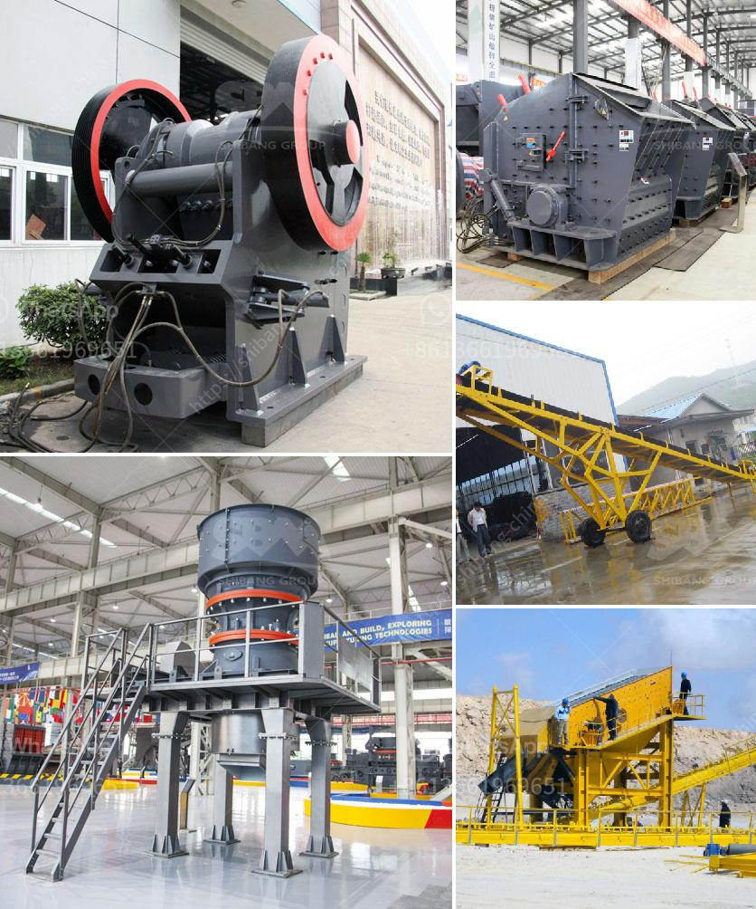

<h3>equipments in gypsum powder production line</h3>
Gypsum is a mineral that is commonly used in the construction industry to produce gypsum powder. It is a versatile material that has many uses and benefits. In order to produce gypsum powder, a production line consisting of various equipment is needed.

One essential piece of equipment in the gypsum powder production line is the crusher, which is used for crushing large-sized gypsum ore into smaller particles under 30mm. The crushed gypsum is then conveyed into a mill for grinding to obtain gypsum powder. Other necessary equipment in the production line includes a storage silo for storing gypsum, a vibratory feeder for feeding gypsum into the mill, a cyclone collector for collecting finished products, and a bag filter for filtering the air.

In addition, a rotary dryer may be used in the production line to reduce the moisture content of the gypsum ore. This helps in improving the efficiency of the mill and ensuring the quality of the final gypsum powder. After drying, the gypsum is then transported to the mill for grinding.

Once the gypsum powder is obtained, it can be used in various applications. It is commonly used in the construction industry for making plasterboards, drywall, and cement. The gypsum powder can also be used as a soil conditioner, a filler in paper production, and as a component in medications and cosmetics.

In conclusion, a gypsum powder production line requires several essential pieces of equipment to efficiently produce high-quality gypsum powder. These include crushers, mills, storage silos, vibratory feeders, cyclone collectors, bag filters, and rotary dryers. By ensuring the proper functioning of each equipment, the production line can consistently produce gypsum powder that meets the requirements of various industries.
<h3>Contact us</h3><ul><li><strong>Whatsapp:&nbsp;<a href="https://wa.me/8613661969651">+8613661969651</a></strong></li><li><a href="https://swt.shibang-china.com/?git&amp;zhl&amp;equipments in gypsum powder production line"><strong>Online Service(chat now)</strong></a></li></ul><h3>Related</h3><ul><li><a href='copper ore ball mill torky.md'>copper ore ball mill torky</a></li><li><a href='crusher machine in bhutan.md'>crusher machine in bhutan</a></li><li><a href='silica sand screening plant.md'>silica sand screening plant</a></li><li><a href='impact crusher specification limestone.md'>impact crusher specification limestone</a></li><li><a href='rubber belt conveyor for sale.md'>rubber belt conveyor for sale</a></li></ul>