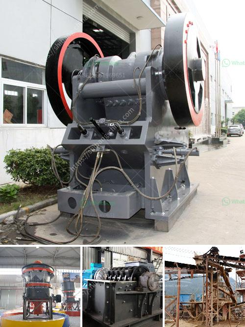

<h3>equipments used in cement industry</h3>
The cement industry is one of the most vital sectors for economic growth in the world. The demand for cement is ever-increasing due to the construction needs of residential, commercial, and industrial establishments. To meet this demand, cement manufacturers require efficient and reliable equipment to produce high-quality cement. In this article, we will discuss some of the essential equipment used in the cement industry.

1. Kilns: Kilns play a crucial role in the cement manufacturing process. They are large cylindrical furnaces where limestone, clay, and other raw materials are heated at extremely high temperatures. This process, known as calcination, transforms the materials into a powdery substance called clinker. Kilns are typically fueled by coal, oil, or natural gas.

2. Crushers: Limestone, clay, and other quarry materials are extracted from the earth and transported to the crushers, where they are crushed into smaller particles. Crushers come in various types such as jaw crushers, gyratory crushers, and roll crushers. Their main purpose is to reduce the size of the raw materials for further processing.

3. Raw Mill: Once the raw materials are crushed, they are transported to the raw mill for grinding. The raw mill grinds the material into a fine powder called raw meal, which is then fed into a preheater system.

4. Preheater System: The preheater system is an integral part of the cement production process. It consists of a series of cyclones and pre-calciner vessels, which preheat and partially calcine the raw meal before it enters the kiln. This system helps to improve the efficiency of the kiln and reduce energy consumption.

5. Cement Mills: After the clinker is cooled, it is ground into a fine powder in cement mills. Currently, there are several types of cement mills available, including ball mills, roller press mills, and vertical roller mills. These mills differ in terms of grinding techniques, power consumption, and maintenance costs.

6. Dust Collectors: Dust collectors are vital in the cement industry to control and minimize the release of harmful particulate matter into the environment. They capture and filter the dust generated during the various stages of cement production, ensuring a healthier working environment for employees and reducing air pollution.

7. Packaging Equipment: Once the cement is produced, it needs to be properly packaged for transportation and sale. Packaging equipment, such as bagging machines and packaging lines, are used to fill cement into bags and seal them for storage or shipment.

In conclusion, the cement industry heavily relies on a variety of equipment to produce high-quality cement efficiently. From kilns and crushers to dust collectors and packaging equipment, each piece of equipment plays a crucial role in the cement manufacturing process. As technology continues to advance, the industry can expect further improvements in equipment design and efficiency, leading to more sustainable and environmentally friendly cement production.
<h3>Contact us</h3><ul><li><strong>Whatsapp:&nbsp;<a href="https://wa.me/8613661969651">+8613661969651</a></strong></li><li><a href="https://swt.shibang-china.com/?git&amp;zhl&amp;equipments used in cement industry"><strong>Online Service(chat now)</strong></a></li></ul><h3>Related</h3><ul><li><a href='stone crusher second hand south africa.md'>stone crusher second hand south africa</a></li><li><a href='stone crusher manufacture.md'>stone crusher manufacture</a></li><li><a href='crusher price in philippines.md'>crusher price in philippines</a></li><li><a href='cement plant grinding unit.md'>cement plant grinding unit</a></li><li><a href='clay making process nigeria.md'>clay making process nigeria</a></li></ul>