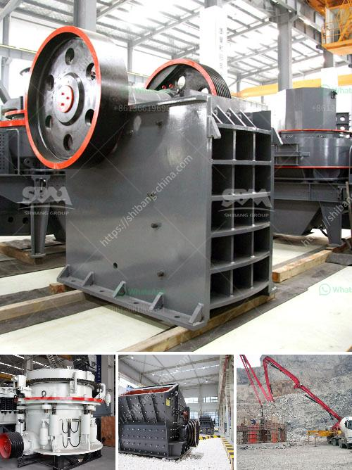

<h3>estimated budget for a conveyor belt</h3>
A conveyor belt is a vital component in various industries as it is responsible for transporting goods and materials efficiently. When considering the installation or replacement of a conveyor belt, it is crucial to estimate the budget accurately to ensure cost-effectiveness. Several factors affect the pricing of conveyor belts, such as the size, material, application, and complexity of the system. Let's delve into these factors further to estimate the budget for a conveyor belt.

The size of the conveyor belt is one of the primary determinants of its cost. Longer belts require more materials, including rubber, metal, and fabric, leading to higher expenses. Additionally, wider belts also come at a higher cost. Hence, it is crucial to determine the required size of the conveyor belt according to the specific needs of the industry.

The material used in the construction of the conveyor belt also affects the estimated budget. Common materials include rubber, PVC, nylon, and steel. Rubber belts are cost-effective and versatile, making them suitable for numerous applications. PVC belts are ideal for industries that require resistance to oils, chemicals, and abrasive materials. Nylon and steel belts are more durable and suitable for heavy-duty applications, but they can be more expensive.

The application of the conveyor belt is another aspect that influences the budget. Belts designed for food-grade applications might require additional features such as easy cleaning and resistance to contamination, resulting in higher costs. Likewise, belts used in mining, construction, or heavy industries need to be robust and designed to withstand abrasive materials and extreme conditions.

Lastly, the complexity of the conveyor system and any additional features also impact the budget. Systems with advanced control mechanisms, sensors, and automation features tend to be more expensive due to the added technology and customization required.

Considering these factors, the estimated budget for a conveyor belt can range between a few hundred dollars to thousands of dollars. For a basic, small-scale conveyor belt, the budget could be around $500-$1,000. However, for larger, more complex systems, the budget can easily reach $5,000-$10,000 or more.

It is crucial to consult with experts or conveyor manufacturers to evaluate the specific requirements and variables that affect the estimated budget accurately. Finding the right balance between cost and quality is essential to ensure long-term efficiency and productivity in your industry.
<h3>Contact us</h3><ul><li><strong>Whatsapp:&nbsp;<a href="https://wa.me/8613661969651">+8613661969651</a></strong></li><li><a href="https://swt.shibang-china.com/?git&amp;zhl&amp;estimated budget for a conveyor belt"><strong>Online Service(chat now)</strong></a></li></ul><h3>Related</h3><ul><li><a href='coal screening crushing machines.md'>coal screening crushing machines</a></li><li><a href='puzzolana crusher tonnes per hour.md'>puzzolana crusher tonnes per hour</a></li><li><a href='gyratory crusher copper mine.md'>gyratory crusher copper mine</a></li><li><a href='stone crusher cement factories in africa.md'>stone crusher cement factories in africa</a></li><li><a href='crushing plant zenith.md'>crushing plant zenith</a></li></ul>