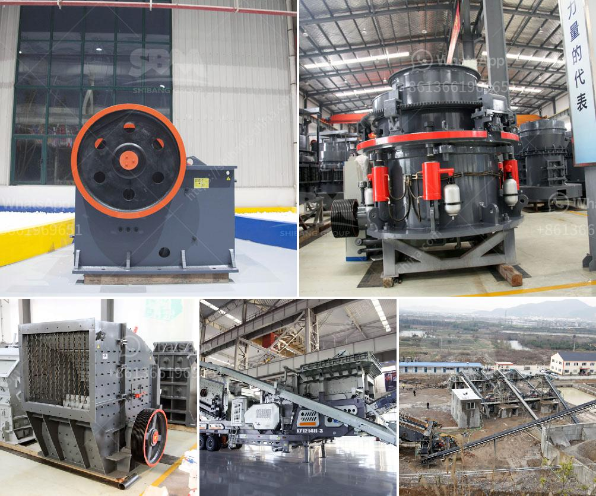

<h3>estimated cost for cement grinding mill</h3>
The cement industry is one of the most vital sectors for economic growth and development around the globe. Its significance can be seen from the fact that it contributes to the creation of infrastructures such as housing, roads, bridges, and factories. Cement grinding mills have become extremely essential in cement production lines, as they help to improve the efficiency and quality of cement manufacturing.

Cement grinding mills are used to grind clinker from the cement kiln and add gypsum to produce the final cement product. The quality of cement depends on the size of the grinding mill and its operation. A cement grinding mill with smaller size allows for the production of finer and higher-quality cement, while larger grinding mills increase the production capacity but also add energy consumption and costs.

The estimated cost of a cement grinding mill varies depending on the manufacturer, technology, and location of the project. The cost for a cement grinding mill ranges from $300,000 to $500,000 per tonne. The cement grinding mills are more efficient and add to the production capacity of the cement manufacturing plant. The cost of a cement grinding mill mainly includes the direct cost of the mill itself, labor expenses, and electricity costs.

The direct cost of the cement grinding mill is determined by its size and capacity. Smaller grinding mills with a capacity of 50-100 tonnes per hour cost around $300,000, whereas larger mills with higher capacity can cost up to $500,000 or more. Additionally, the cost of raw materials, spare parts, and maintenance also contribute to the direct cost of the cement grinding mill.

Labor expenses are another significant factor in calculating the estimated cost of a cement grinding mill. Skilled manpower is required to operate and maintain the mill efficiently. The number of operators required depends on the size and complexity of the mill. Additionally, the experience and expertise of the operators also affect the labor expenses. On average, labor expenses can amount to 10-15% of the total estimated cost.

Electricity costs are another crucial aspect to consider when estimating the cost of a cement grinding mill. The grinding process requires a significant amount of electrical energy. The exact electricity consumption depends on the size and efficiency of the mill. However, it is generally estimated that the electricity cost contributes to around 15-20% of the total estimated cost.

In conclusion, the estimated cost for a cement grinding mill ranges from $300,000 to $500,000 per tonne. The cost primarily depends on factors such as the size, capacity, and technology of the mill. It is crucial to consider the direct cost of the mill itself, labor expenses, and electricity costs when estimating the overall cost. Cement grinding mills play a vital role in the cement industry, ensuring that the final product is of high quality and meets the required standards.
<h3>Contact us</h3><ul><li><strong>Whatsapp:&nbsp;<a href="https://wa.me/8613661969651">+8613661969651</a></strong></li><li><a href="https://swt.shibang-china.com/?git&amp;zhl&amp;estimated cost for cement grinding mill"><strong>Online Service(chat now)</strong></a></li></ul><h3>Related</h3><ul><li><a href='cement boll mill grinding.md'>cement boll mill grinding</a></li><li><a href='belt conveyor for sale china.md'>belt conveyor for sale china</a></li><li><a href='mobile and modular coal washing plants.md'>mobile and modular coal washing plants</a></li><li><a href='high energy ball mill price.md'>high energy ball mill price</a></li><li><a href='used screens crushers for coal uk.md'>used screens crushers for coal uk</a></li></ul>