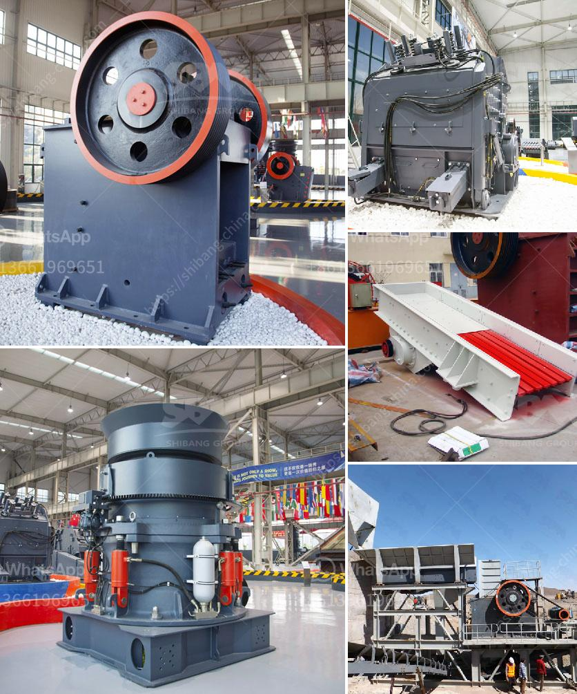

<h3>europe crusher producers</h3>
Europe is a leading player in the global crusher production market. The continent's robust industrial infrastructure and decades of expertise in various industries have led to the emergence of some of the most renowned crusher producers in the world. These European manufacturers have not only perfected the art of crafting high-quality crushers but also continue to innovate, ensuring a steady supply of cutting-edge technology.

One such prominent crusher producer in Europe is Metso Outotec. With a rich history dating back to the 19th century, Metso Outotec has become a global leader in the mining and aggregates industries. Its comprehensive range of crushers, from jaw and cone crushers to impact and roll crushers, caters to various requirements and applications. Metso Outotec's commitment to sustainability is also evident in its focus on energy-efficient solutions that minimize environmental impact.

Another notable European manufacturer is Sandvik, known for its advanced and reliable crushing equipment. Sandvik's crushers are renowned for their durability, efficiency, and versatility. The company offers a wide range of models, including jaw crushers, impact crushers, and cone crushers, ensuring that their machines can tackle any material processing need. Sandvik's emphasis on innovation is evident through its continuous development of state-of-the-art technologies like automated control systems and remote monitoring.

Thyssenkrupp, a German engineering conglomerate, is another prominent player in Europe's crusher production sector. Thyssenkrupp's crushers are particularly renowned for their high capacity and throughput, making them ideal for large-scale mining and quarrying operations. The company's crushing technology is constantly evolving, with a focus on efficient material reduction and reliable performance.

Europe's crusher producers are not limited to these three companies. Many other manufacturers, such as Terex Corporation, Keestrack, and McCloskey International, also contribute to the region's vibrant crusher production landscape. Each of these companies brings its unique expertise, product range, and customer-centric approach to the market, ensuring a healthy competition that drives innovation.

In conclusion, Europe is home to several leading crusher producers who have shaped the industry with their commitment to quality, innovation, and sustainability. These companies continue to push the boundaries of crusher technology, ensuring that Europe remains a key player in the global market. Whether for mining, construction, or recycling applications, European crushers offer efficiency, reliability, and durability that cater to diverse customer needs.
<h3>Contact us</h3><ul><li><strong>Whatsapp:&nbsp;<a href="https://wa.me/8613661969651">+8613661969651</a></strong></li><li><a href="https://swt.shibang-china.com/?git&amp;zhl&amp;europe crusher producers"><strong>Online Service(chat now)</strong></a></li></ul><h3>Related</h3><ul><li><a href='jaw crusher in dubai.md'>jaw crusher in dubai</a></li><li><a href='iron ore beneficiation poland.md'>iron ore beneficiation poland</a></li><li><a href='small scale gold refinery plant equipments.md'>small scale gold refinery plant equipments</a></li><li><a href='sell jaw crusher.md'>sell jaw crusher</a></li><li><a href='difference between hp cone crusher.md'>difference between hp cone crusher</a></li></ul>