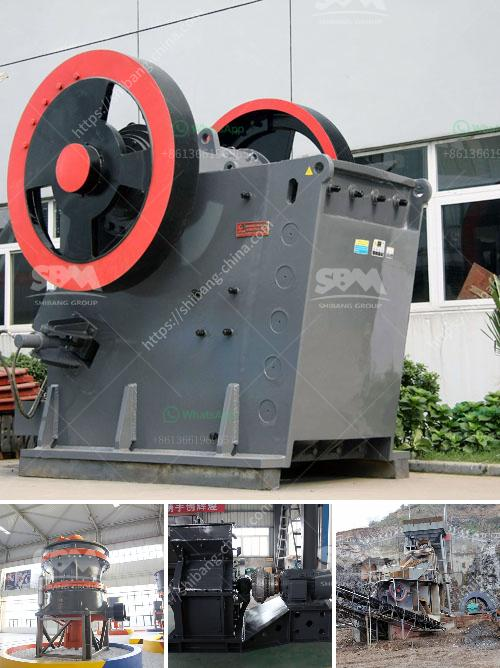

<h3>feasibility study for the establishment of quarry</h3>
The quarry business being proposed in this brief study is about the establishment of a quarry site where large deposits of stone/granites will be blasted and crushed into 'chippings' of varying sizes/Stone/granites deposits have been identified. The identified site will support the production of chippings for quite a long period of time. The Reserve Deposit is estimated to last for 50 years at a yearly production of 500,000 tons/year.

This is a sample of an already written and calculated feasibility study/business plan for quarry business, we are professionals in writing business plans of any kind. We can do this for you at a very reduced rate.

The quarry business is capital intensive and requires huge amounts of investment to secure storage areas for the products and purchase heavy equipment that will be used in the operations of the business. Also, trucks and other relevant vehicles for transporting aggregate products are key components of the business. The availability of these trucks and other vehicles is essential to the success of the quarry operation.

Transportation costs are a major factor in the quarry business. The higher the transportation cost, the less competitive a quarry operation becomes. Therefore, the establishment of a quarry site near a market is very essential. Furthermore, when large quantities of stone products are produced and stored near the construction sites, it adds greatly to the convenience and economics of the construction process.

A feasibility study is carried out with the aim of assessing the safe and economic feasibility of the intended quarrying activity. The study shows that the quarry is profitable with a positive net present value (NPV). There will be little opportunity to import stone/ganites from other countries given their high transportation costs. Therefore, the demand for chippings will remain strong and steady. The local markets are already well established and customers are loyal to the local products, and hence there will always be demand. This therefore means that the proposed quarry is technically viable and financially profitable.

The demand for chippings is increasing steadily as urban areas continue to expand. As the population grows, housing and infrastructure construction increase accordingly. The market for crushed stone and chippings is not only very large in Nigeria, but demand is also ever-increasing. Furthermore, as government spending on infrastructure development continues to increase, it will provide additional opportunities for the growth of the quarry business.

The proposed quarry project is aimed at achieving a long-term strategic goal of developing a flagship of all quarry operations in Nigeria. Firstly, the raw material are crushed initially by the jaw crusher. We are reputable suppliers of gravel & crushed stone in Nigeria, with various sizes such as 3⁄4, 3⁄8, 1⁄2, 3/16, 5⁄16 & 5/8&nbssp;. These products have been tested and created to meet up with strict specifications as required in the industry. Secondly, the layout plan of the proposed quarry is investigated and developed with close consideration to the required machinery and equipment required and available.

Quarrying activities have environmental and social impacts, which can affect neighboring areas and communities. Therefore, environmental regulations and guidelines must be followed to ensure that mining activities are conducted responsibly. This includes minimizing noise, dust, and vibration levels, as well as proper waste management. The proposed quarry project has taken all necessary measures to minimize these impacts. It is important to note that the project complies with all legal requirements and follows international best practices.

The establishment of a quarry in a local area is key to the development of that area. The availability of aggregates maintains the momentum of construction activity and drives economic development. Based on the positive results from the feasibility study, it is clear that establishing a quarry is a viable investment opportunity. With the growing demand for granites, stones, and other construction materials in Nigeria, investing in quarry business is a wise choice. However, proper evaluation of each potential site is required before any investment is made to minimize risks and maximize returns.
<h3>Contact us</h3><ul><li><strong>Whatsapp:&nbsp;<a href="https://wa.me/8613661969651">+8613661969651</a></strong></li><li><a href="https://swt.shibang-china.com/?git&amp;zhl&amp;feasibility study for the establishment of quarry"><strong>Online Service(chat now)</strong></a></li></ul><h3>Related</h3><ul><li><a href='crusher primary mobile crusher.md'>crusher primary mobile crusher</a></li><li><a href='controlling parameter of impact crusher.md'>controlling parameter of impact crusher</a></li><li><a href='cement plant process flow diagram ppt.md'>cement plant process flow diagram ppt</a></li><li><a href='screener crusher china.md'>screener crusher china</a></li><li><a href='price of a stone crusher.md'>price of a stone crusher</a></li></ul>