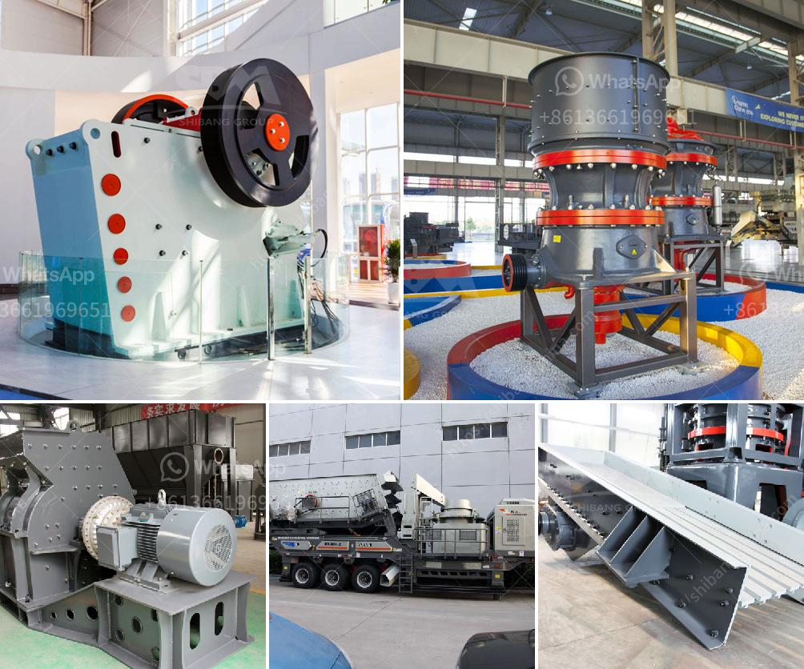

<h3>fine grinding ball mills</h3>
Fine grinding ball mills are widely used in the mining industry to grind various ores and rocks with different hardness. They are an important equipment for reducing the size of the material to create a desired particle size distribution in the downstream processes. 

Fine grinding ball mills consist of a hollow cylindrical shell rotating about its axis. The shell is filled with grinding media, which are balls of different sizes. The material to be ground is fed into the shell through a hollow trunnion at the end of the mill. As the shell rotates, the grinding media are lifted up and cascade down, impacting and grinding the material. The fine particles pass through the screen in the mill and are discharged as product, while the coarse particles are returned to the mill for further grinding.

The size of the grinding media and the speed of rotation of the mill determine the fineness of the particles produced. Smaller grinding media lead to finer particles, while higher mill speeds provide more impact and grinding action. The material being ground also affects the efficiency of the grinding process. Harder materials require more energy to grind and may result in higher wear of the grinding media and mill components.

Fine grinding ball mills have several advantages over other grinding methods. They offer a higher grinding efficiency and can produce finer particles compared to rod mills or other tumbling mills. The uniform size distribution of the grinding media in the mill also ensures a more consistent final product. Additionally, the availability of different types of grinding media allows for customization and optimization of the grinding process for specific applications.

In conclusion, fine grinding ball mills are essential equipment in the mining industry for achieving the desired particle size distribution. They offer high grinding efficiency, customization options, and consistent product quality. Proper selection of grinding media, mill speed, and material being ground is crucial for optimizing the grinding process and achieving the desired results.
<h3>Contact us</h3><ul><li><strong>Whatsapp:&nbsp;<a href="https://wa.me/8613661969651">+8613661969651</a></strong></li><li><a href="https://swt.shibang-china.com/?git&amp;zhl&amp;fine grinding ball mills"><strong>Online Service(chat now)</strong></a></li></ul><h3>Related</h3><ul><li><a href='35 in raymond vertical roller mill.md'>35 in raymond vertical roller mill</a></li><li><a href='gold ore processing nigeria.md'>gold ore processing nigeria</a></li><li><a href='cutting milling machine for marble and granite.md'>cutting milling machine for marble and granite</a></li><li><a href='sand making machine zenith.md'>sand making machine zenith</a></li><li><a href='crusher in antioquia stone crusher.md'>crusher in antioquia stone crusher</a></li></ul>