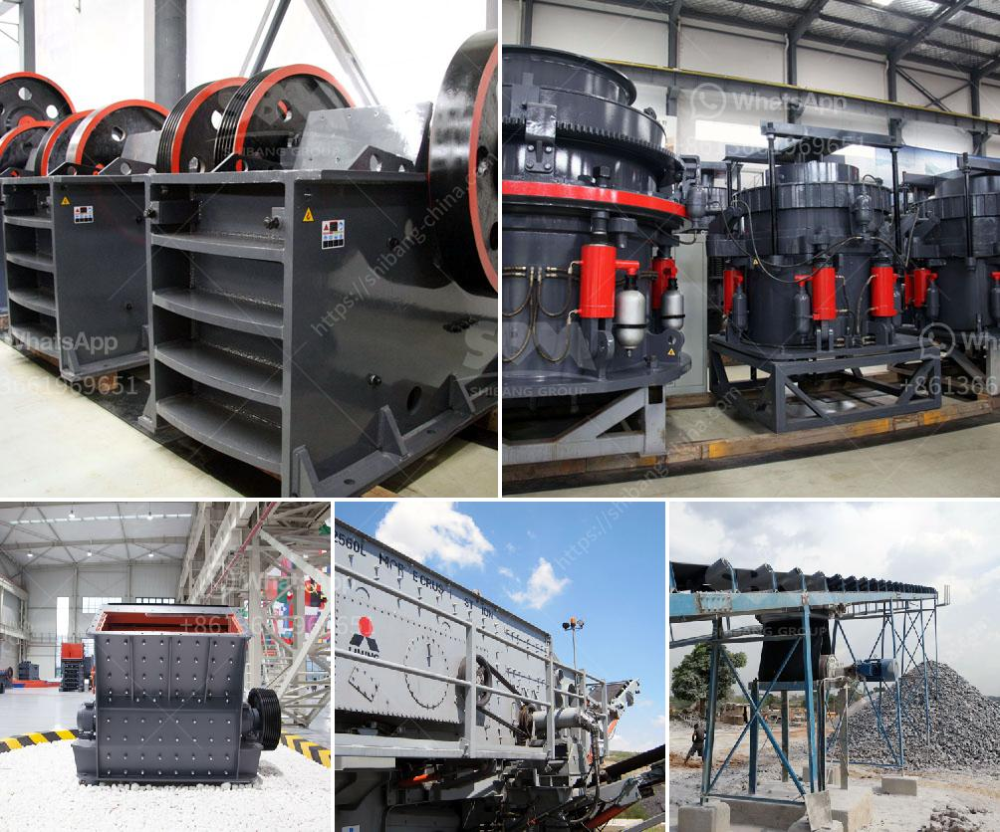

<h3>floating processing mining plants</h3>
In recent years, the mining industry has faced numerous challenges, particularly related to the environmental impact of mining operations and the scarcity of available resources. However, a promising new solution has emerged in the form of floating processing mining plants. These innovative floating structures are set to revolutionize the industry by offering more sustainable and efficient resource extraction methods.

One of the primary advantages of floating processing mining plants is their flexibility and mobility. Unlike traditional on-land mining facilities, these floating structures can be moved to areas with high resource potential. This adaptability allows for effective exploitation of previously untapped resources, reducing the need for extensive land-based mining operations and associated infrastructure.

Moreover, floating processing mining plants have less impact on the environment. The modular design of these plants ensures minimal disturbance to sensitive ecosystems, as they can be easily disassembled and removed when the resource is exhausted. This mitigates the long-term environmental consequences often associated with traditional mining operations, such as habitat destruction and soil contamination.

Additionally, floating processing mining plants can leverage cutting-edge technology to improve efficiency. These facilities are equipped with advanced equipment and machinery, enabling faster and more precise resource extraction processes. The integration of sensors, automated systems, and robotic technology ensures higher accuracy and optimizes the use of resources, ultimately increasing productivity.

Often powered by renewable energy sources, such as solar or wind, floating processing mining plants also contribute to a cleaner and greener future. By reducing reliance on fossil fuels, these plants significantly decrease greenhouse gas emissions, further combating climate change.

However, it is important to address potential challenges and concerns associated with floating processing mining plants, such as the impact on marine ecosystems and local communities. Comprehensive environmental assessments and stakeholder engagement should be conducted to ensure sustainable practices and minimize social and ecological disturbance.

In conclusion, floating processing mining plants represent a promising solution for efficient and sustainable resource extraction. Their flexibility, minimal environmental impact, advanced technology, and use of renewable energy make them a valuable asset for the mining industry. By embracing this innovative approach, we can mitigate the environmental consequences of resource extraction while ensuring the availability of crucial raw materials for future generations.
<h3>Contact us</h3><ul><li><strong>Whatsapp:&nbsp;<a href="https://wa.me/8613661969651">+8613661969651</a></strong></li><li><a href="https://swt.shibang-china.com/?git&amp;zhl&amp;floating processing mining plants"><strong>Online Service(chat now)</strong></a></li></ul><h3>Related</h3><ul><li><a href='slag grinding plant.md'>slag grinding plant</a></li><li><a href='market analysis of stone crusher.md'>market analysis of stone crusher</a></li><li><a href='small washing plants diamonds.md'>small washing plants diamonds</a></li><li><a href='price of copper smelting plant.md'>price of copper smelting plant</a></li><li><a href='largest quarry machine manufacturer.md'>largest quarry machine manufacturer</a></li></ul>