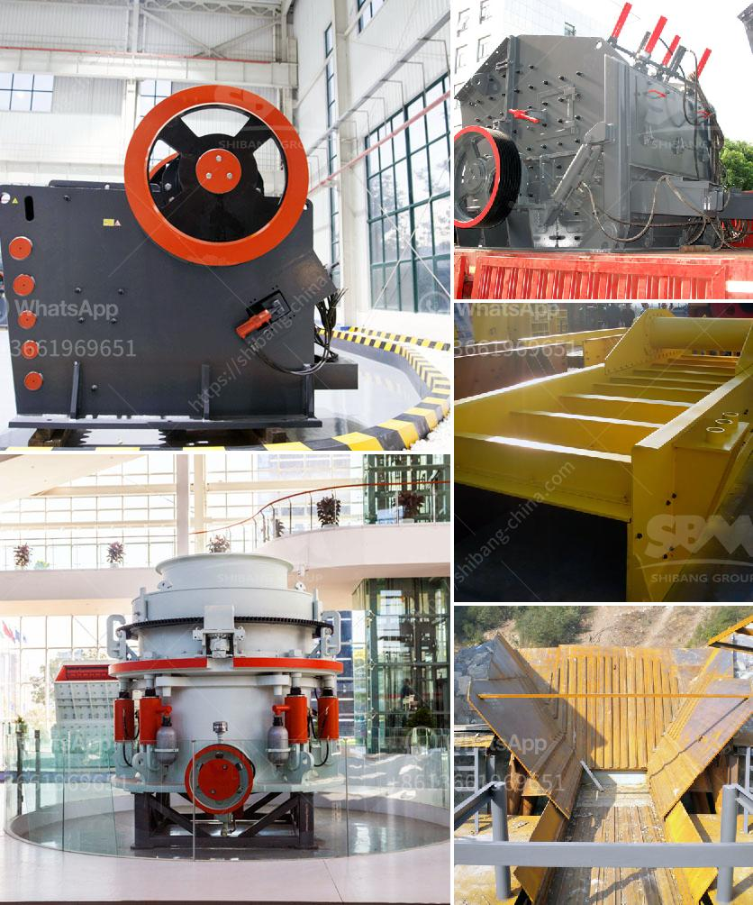

<h3>flow chart for gold extraction from ores</h3>
Gold is a valuable metal that has been coveted by humans for thousands of years. Its unique properties, such as its ability to resist corrosion and conduct electricity, have made it an essential component in various industries, including jewelry, electronics, and dentistry. However, extracting gold from its ores is a complex process that requires meticulous planning and execution. In this article, we will explore the flowchart for gold extraction from ores.

The first step in the gold extraction process is crushing the ore into smaller pieces. This is achieved by using a jaw crusher, a device that uses mechanical pressure to break the ore into smaller fragments. The fragmented ore is then ground into a fine powder in a ball mill, a rotating cylindrical vessel that uses steel balls as grinding media.

Once the ore is reduced to a fine powder, it is then mixed with water to create a slurry. This slurry is then subjected to a process called cyanidation, which is the primary method used for gold extraction. In cyanidation, the powdered ore is mixed with a dilute cyanide solution, which dissolves the gold and forms a soluble complex. This complex is then separated from the rest of the slurry using various techniques, such as carbon adsorption or precipitation.

During the cyanidation process, it is crucial to control several variables. The pH of the solution needs to be carefully regulated to ensure optimal dissolution of gold. Additionally, the concentration of cyanide needs to be monitored to prevent the formation of toxic gases, such as hydrogen cyanide. Adequate oxygen supply is also critical for efficient gold dissolution.

After the gold has been dissolved, it is then recovered from the cyanide solution. This is typically done using activated carbon, which has a high affinity for gold. The cyanide solution is passed through a series of tanks filled with activated carbon, where the gold adsorbs onto the carbon surface. The loaded carbon is then washed with a caustic solution to remove any remaining cyanide and impurities before the gold is desorbed. The desorbed gold is then collected and smelted to produce a gold doré, which is a semi-pure alloy of gold and silver.

In some cases, depending on the ore composition, additional steps may be necessary to extract gold. These may include processes such as gravity separation, flotation, or leaching with other chemicals. The selection of the appropriate process depends on the specific characteristics of the ore and the desired purity of the final product.

In conclusion, the extraction of gold from ores is a complex process that involves several stages and requires careful planning and execution. The flowchart for gold extraction from ores includes crushing, grinding, cyanidation, carbon adsorption, desorption, and smelting. Understanding the ore composition and the desired purity of the final product is crucial in designing and optimizing the extraction process. By following the appropriate flowchart, miners can efficiently extract gold and maximize its value.
<h3>Contact us</h3><ul><li><strong>Whatsapp:&nbsp;<a href="https://wa.me/8613661969651">+8613661969651</a></strong></li><li><a href="https://swt.shibang-china.com/?git&amp;zhl&amp;flow chart for gold extraction from ores"><strong>Online Service(chat now)</strong></a></li></ul><h3>Related</h3><ul><li><a href='rock crushing machine for concrete use.md'>rock crushing machine for concrete use</a></li><li><a href='raymond mills india.md'>raymond mills india</a></li><li><a href='crusher plant equipment supplier in saudi arabia.md'>crusher plant equipment supplier in saudi arabia</a></li><li><a href='hammer mills in south africa.md'>hammer mills in south africa</a></li><li><a href='hammer crusher birotor.md'>hammer crusher birotor</a></li></ul>