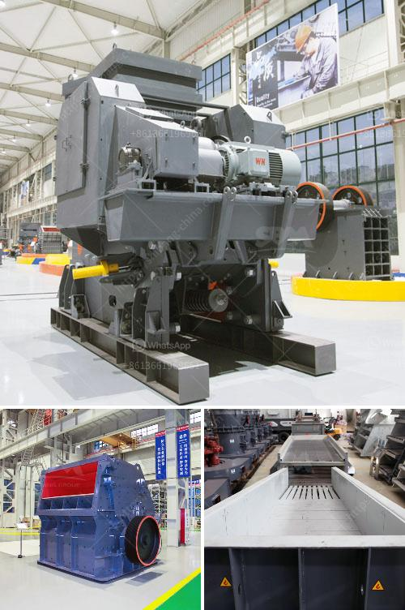

<h3>flow diagram for limestone process</h3>
The flow diagram is a visual representation of the steps involved in the limestone processing and the flow of materials through the system. Since limestone is a naturally occurring mineral, we must first mine it from the earth. Once extracted, it goes through a series of crushing, screening, and washing processes to produce various grades of limestone products.

The first step in the limestone process is the extraction from the quarry. After blasting and drilling, the mined limestone is loaded onto trucks and transported to the primary crushing plant. Depending on the size of the feedstone required, limestone may go through a secondary or tertiary crusher to further reduce its size.

After crushing, the limestone is screened to separate the different sizes of the stone. The oversized pieces are then returned to the crusher for further crushing, while the properly sized limestone moves forward in the process. The screened limestone is then washed to remove any fines or impurities.

Once washed, the limestone is ready for further processing. It may be crushed into smaller sizes or milled into a powder, depending on the intended use. For example, finely ground limestone is used in the production of cement, while larger sizes are used for road construction or as aggregate in concrete.

Throughout the process, various pieces of equipment are utilized to complete each step. These can include crushers, screens, washers, and mills. The flow diagram provides a clear illustration of how these components work together to produce the final limestone products.

In conclusion, the flow diagram for the limestone process outlines the steps involved in the extraction, crushing, screening, washing, and further processing of limestone. It serves as a valuable tool for understanding how limestone is transformed into various products used in industries such as construction and cement manufacturing.
<h3>Contact us</h3><ul><li><strong>Whatsapp:&nbsp;<a href="https://wa.me/8613661969651">+8613661969651</a></strong></li><li><a href="https://swt.shibang-china.com/?git&amp;zhl&amp;flow diagram for limestone process"><strong>Online Service(chat now)</strong></a></li></ul><h3>Related</h3><ul><li><a href='cobalt ore equipments nigeria.md'>cobalt ore equipments nigeria</a></li><li><a href='crushing plant aggregates in south africa.md'>crushing plant aggregates in south africa</a></li><li><a href='grinding mill machine price.md'>grinding mill machine price</a></li><li><a href='gypsum stone crusher machine.md'>gypsum stone crusher machine</a></li><li><a href='gravel production line.md'>gravel production line</a></li></ul>