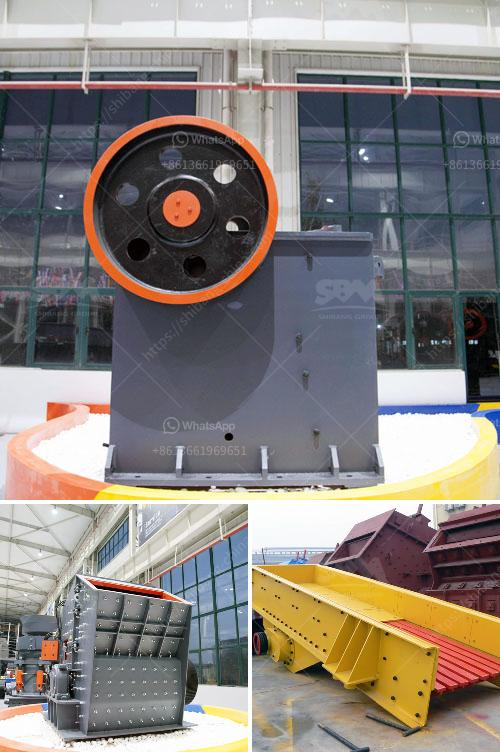

<h3>flowsheet for crushing plant</h3>
The first step in the flowchart is the primary crushing stage, where oversized rocks are broken down to a size that can be further processed through various secondary and tertiary crushers. The material is typically transported by dump trucks and fed into a receiving hopper, from where it is conveyed to a jaw crusher. 

In the jaw crusher, the rock is crushed between two plates, known as jaws. The movable jaw moves back and forth against the fixed jaw, exerting pressure on the rock until it reaches the desired size. The crushed rock is then transported to a vibrating screen, where it is separated into different sizes according to the application requirements. 

The oversize material from the vibrating screen is sent to a secondary crusher, such as a cone crusher or impact crusher. This stage further reduces the size of the crushed rock to a size suitable for the tertiary crushing process. 

The tertiary crushing stage involves utilizing a specialized crusher, known as a vertical shaft impactor (VSI), to produce fine aggregates. The VSI crusher operates by accelerating rocks against a rotor, which then impacts them at high velocity, causing them to break apart and produce smaller particles. 

The final product from the crushing plant is then conveyed to storage bins or stockpiles for further processing or utilization. This can include additional crushing and screening stages, as well as blending of different products to meet specific customer requirements. 

Overall, the flowsheet for a crushing plant involves several stages of crushing, screening, and conveying to produce the final product. In the primary crushing stage, the rock is broken down to a manageable size, enabling further processing. In the secondary and tertiary stages, the rock is further reduced and refined for specific applications. The final product is then stored or stockpiled, ready for distribution or further processing. 

In conclusion, a flowsheet for a crushing plant is a fundamental and essential component of any successful mineral processing operation. It serves as a roadmap for the entire process, outlining each step to ensure optimal efficiency, productivity, and quality in the production of crushed rock products.
<h3>Contact us</h3><ul><li><strong>Whatsapp:&nbsp;<a href="https://wa.me/8613661969651">+8613661969651</a></strong></li><li><a href="https://swt.shibang-china.com/?git&amp;zhl&amp;flowsheet for crushing plant"><strong>Online Service(chat now)</strong></a></li></ul><h3>Related</h3><ul><li><a href='largest quarry machine manufacturer.md'>largest quarry machine manufacturer</a></li><li><a href='stone ball mill up to 2500 mesh.md'>stone ball mill up to 2500 mesh</a></li><li><a href='silica sand screening plant.md'>silica sand screening plant</a></li><li><a href='gypsum vibrating screen.md'>gypsum vibrating screen</a></li><li><a href='stone crusher pfs price.md'>stone crusher pfs price</a></li></ul>