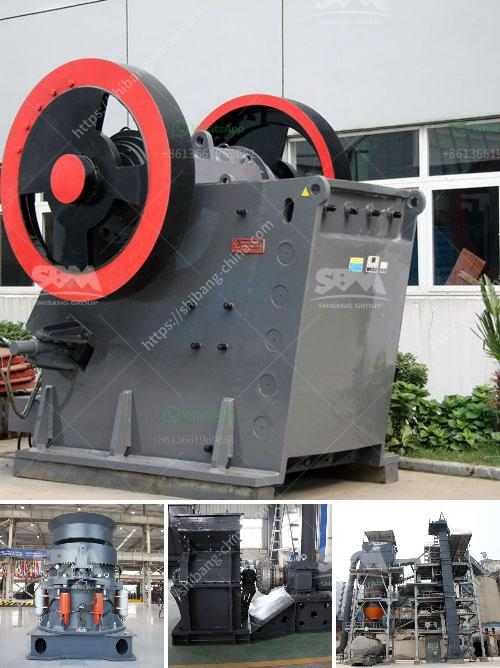

<h3>fly ash crusher unit india</h3>
Fly ash, also known as pulverized fuel ash, is a byproduct obtained from coal-fired power plants. It is a fine powder that is a mixture of inorganic and organic materials. With rapid urbanization and industrialization, the demand for electricity has been increasing, leading to an increase in coal combustion. As a result, there is a significant amount of fly ash generated in India.

Fly ash has various applications in construction, agriculture, and manufacturing industries. It is commonly used in the production of cement, concrete, bricks, and other building materials. However, before it can be used, it needs to undergo a crushing process to reduce its particle size and improve its usability.

In India, there are several manufacturers and suppliers of fly ash crusher units. These units use various crushing techniques to reduce the size of fly ash particles and make it suitable for use in various applications. One such unit is the fly ash crusher unit India.

The fly ash crusher unit India is designed specifically for the crushing and breaking of large and medium-sized coal-fired power plant fly ash sludge. It adopts the innovative technology and combines the traditional crushing technologies, making it more efficient and environmentally friendly. It is widely used in the cement, building materials, thermal power, metallurgical and chemical industries.

The fly ash crusher unit India is mainly composed of frame, body, crushing plate, sheet metal, stamping, bracket and other parts. The body and the crushing plate are made of special wear-resistant materials, which can reduce wear and extend the service life. The spring is used as a safety device to prevent damage to the crusher unit when foreign objects enter the crushing chamber.

The fly ash crusher unit India is equipped with a vibrating feeder and a vibrating screen, which are perfectly integrated with the crusher unit to improve overall efficiency. The vibrating feeder ensures uniform feeding and avoids clogging the crusher unit. The vibrating screen is equipped with a rotating screen box and a changeable screen mesh. It can screen out different sizes of fly ash particles according to specific requirements.

In addition, the fly ash crusher unit India is equipped with dust removal equipment to minimize dust pollution and noise pollution during the crushing process. The dust removal equipment uses a high-pressure water spraying system to suppress and capture dust particles, ensuring a clean and healthy working environment.

The fly ash crusher unit India is highly reliable and versatile, enabling complete crushing and grinding operations. It is the best choice for crushing and grinding fly ash particles. It not only provides high-quality fly ash particles, but also ensures low energy consumption and reduced production costs.

In conclusion, the fly ash crusher unit India is a valuable addition to the construction, agriculture, and manufacturing industries. It is a cost-effective solution that enhances the usability of fly ash and promotes sustainable development. With its advanced technology and efficient performance, it has become an essential equipment in the fly ash processing industry.
<h3>Contact us</h3><ul><li><strong>Whatsapp:&nbsp;<a href="https://wa.me/8613661969651">+8613661969651</a></strong></li><li><a href="https://swt.shibang-china.com/?git&amp;zhl&amp;fly ash crusher unit india"><strong>Online Service(chat now)</strong></a></li></ul><h3>Related</h3><ul><li><a href='stone crusher machine company in usa.md'>stone crusher machine company in usa</a></li><li><a href='difference between pebble and stone.md'>difference between pebble and stone</a></li><li><a href='tph mobile crushing plant.md'>tph mobile crushing plant</a></li><li><a href='quartz manufacturing process.md'>quartz manufacturing process</a></li><li><a href='limestone jaw crusher for sale.md'>limestone jaw crusher for sale</a></li></ul>