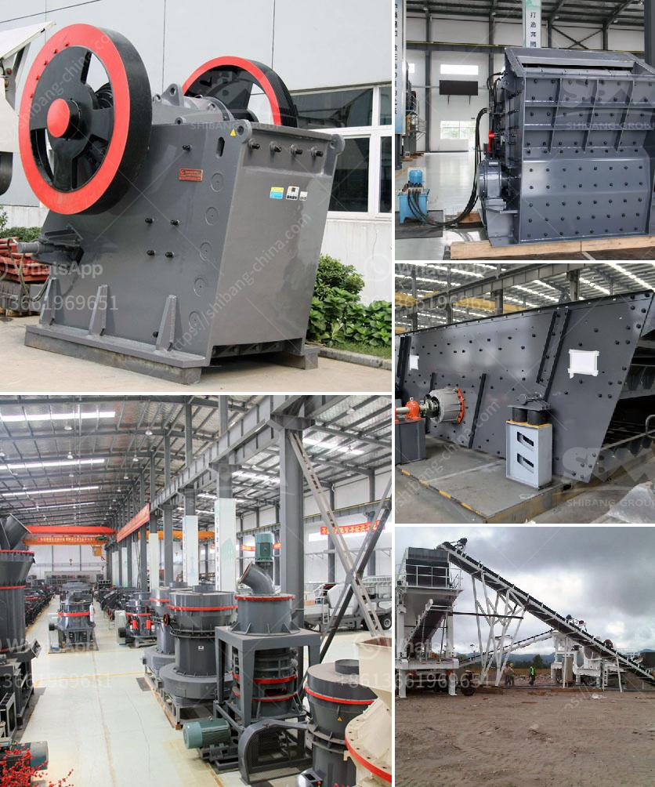

<h3>for sale used mobile jaw crusher australia</h3>
In today's rapidly evolving world, it is essential to comprehend the latest trends and technologies used when it comes to crushing and screening equipment. Fortunately, Australia is blessed with an abundance of jaw crushers, offering some of the best options for those who are looking to enhance their productivity and reduce downtime.

When it comes to jaw crushers, one term stands out: mobility. The ability to move from one site to another quickly and efficiently is paramount in modern construction and mining operations. This is where a used mobile jaw crusher comes into play. These machines provide the flexibility needed to maximize productivity and minimize operational costs, making them an ideal choice for various industries.

One such used mobile jaw crusher available in Australia is the 2012 Sandvik QJ341, featuring a CJ211 1100mm x 700mm jaw opening and capable of tackling the most demanding applications. It is designed to meet the needs of the operator seeking a high-performance mobile jaw crusher, which is both reliable and durable. The QJ341 is equipped with a unique PLC control system that provides excellent productivity by optimizing the material flow.

The Sandvik QJ341 features a world-renowned Sandvik CJ series jaw crusher with a feed opening of 1100mm x 700mm. This allows for exceptional rates of production, making it suitable for a wide range of applications. The crusher's hydraulically adjustable CSS (closed side setting) allows for precise control of the final product size, ensuring the desired output is achieved. Additionally, the QJ341 is powered by a CAT C9 engine, providing ample power for any crushing task.

Another great option is the 2018 Terex Finlay J-1175, which boasts excellent mobility, ease of operation, and high productivity. This mobile jaw crusher offers a robust design featuring a heavy-duty hopper, a variable speed grizzly feeder, and a 42" x 30" single toggle jaw chamber. With a maximum output of up to 475tph, this machine is suitable for a wide range of applications, including quarrying, mining, and recycling.

The Terex Finlay J-1175 prioritizes user convenience, with features such as a fully hydraulic CSS that can be adjusted remotely and a detachable onboard radial stockpiler to ensure efficient use of available space. Furthermore, the J-1175 offers flexibility, as it can be easily transported from one site to another, making it an excellent choice for contractors and rental companies.

Purchasing a used mobile jaw crusher often represents a cost-effective alternative to buying a new one. However, it is crucial to ensure that the equipment is in good working condition to avoid any unexpected downtime. Therefore, it is advisable to engage with reputable sellers who provide comprehensive information about the machine's history, maintenance records, and any necessary repairs or replacements that have been carried out.

In conclusion, a used mobile jaw crusher in Australia offers the ideal solution for those looking to enhance their productivity and reduce operational costs. The models mentioned above provide excellent mobility, reliability, and optimal performance. Investing in a reliable used mobile jaw crusher will undoubtedly benefit your operations, allowing you to extract maximum value from your resources while maintaining efficiency and profitability.
<h3>Contact us</h3><ul><li><strong>Whatsapp:&nbsp;<a href="https://wa.me/8613661969651">+8613661969651</a></strong></li><li><a href="https://swt.shibang-china.com/?git&amp;zhl&amp;for sale used mobile jaw crusher australia"><strong>Online Service(chat now)</strong></a></li></ul><h3>Related</h3><ul><li><a href='chrome crusher philippines.md'>chrome crusher philippines</a></li><li><a href='granite quarry plants.md'>granite quarry plants</a></li><li><a href='tons stationary impact granite crusher.md'>tons stationary impact granite crusher</a></li><li><a href='silica sand grinding.md'>silica sand grinding</a></li><li><a href='the company mines limestone in ethiopia.md'>the company mines limestone in ethiopia</a></li></ul>