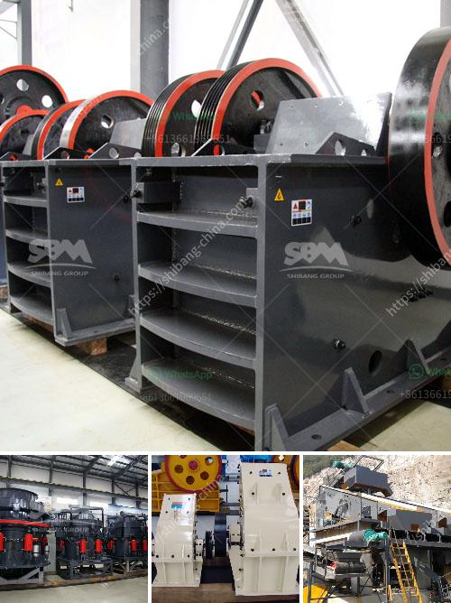

<h3>functions conical crusher</h3>
A conical crusher, commonly known as a cone crusher, is a versatile machine that is typically used in mining or construction industries for crushing materials. It features a cone-shaped eccentric shaft that rotates within a fixed outer mantle to crush rocks and other materials between it and the concave (the stationary inner surface of the mantle). This article will explore the various functions of a conical crusher, highlighting its importance in the industry.

1. Crushing Efficiency: One of the primary functions of a conical crusher is to break down large rocks into smaller ones. By compressing the material between the mantle and concave, it creates smaller particles, making it easier to handle and transport. The efficient crushing action allows for a higher crushing capacity and a reduction in power consumption.

2. Shape and Size Control: The conical crusher is well-known for its ability to produce well-graded and cubical-shaped end products. This is achieved by the rotating eccentric shaft, which forces the rocks to break under pressure. The resulting crushed material is more uniform in shape and size, which is crucial for many applications, such as concrete production or road construction.

3. Adjustment Capabilities: Another important function of a conical crusher is its ability to adjust the size of the discharge opening. This allows for precise control over the final product size, making it suitable for various applications. By adjusting the eccentricity of the shaft, operators can easily modify the crusher's output to meet specific requirements.

4. Protection Against Overload: Conical crushers are equipped with advanced hydraulic systems that provide overload protection. In case of excessive load or tramp iron, these systems automatically release the pressure and allow the crusher to clear the obstruction. This feature prevents damage to the crusher and ensures continuous operation, reducing downtime and maintenance costs.

5. Versatility: Conical crushers come in different sizes and configurations, making them suitable for a wide range of applications. From hard and abrasive rocks to soft and non-abrasive materials, these crushers can handle various types of feed materials. Additionally, they can be used in secondary, tertiary, or quaternary stages of crushing, depending on the specific needs of the process.

In conclusion, a conical crusher plays a crucial role in the mining and construction industries. Its ability to efficiently crush materials, control product size and shape, adjust the discharge opening, provide overload protection, and offer versatility makes it an indispensable tool for many operations. Operators can rely on this machine to produce high-quality aggregates, minimize downtime, and maximize productivity. With ongoing advancements in technology, conical crushers continue to improve and evolve, providing even greater efficiency and performance in the future.
<h3>Contact us</h3><ul><li><strong>Whatsapp:&nbsp;<a href="https://wa.me/8613661969651">+8613661969651</a></strong></li><li><a href="https://swt.shibang-china.com/?git&amp;zhl&amp;functions conical crusher"><strong>Online Service(chat now)</strong></a></li></ul><h3>Related</h3><ul><li><a href='gypsum bord plant factorie price.md'>gypsum bord plant factorie price</a></li><li><a href='used sand screen in south africa sale.md'>used sand screen in south africa sale</a></li><li><a href='price of crusher.md'>price of crusher</a></li><li><a href='iron ore crushing equipment in mexico.md'>iron ore crushing equipment in mexico</a></li><li><a href='defination of machine aggregate crusher.md'>defination of machine aggregate crusher</a></li></ul>