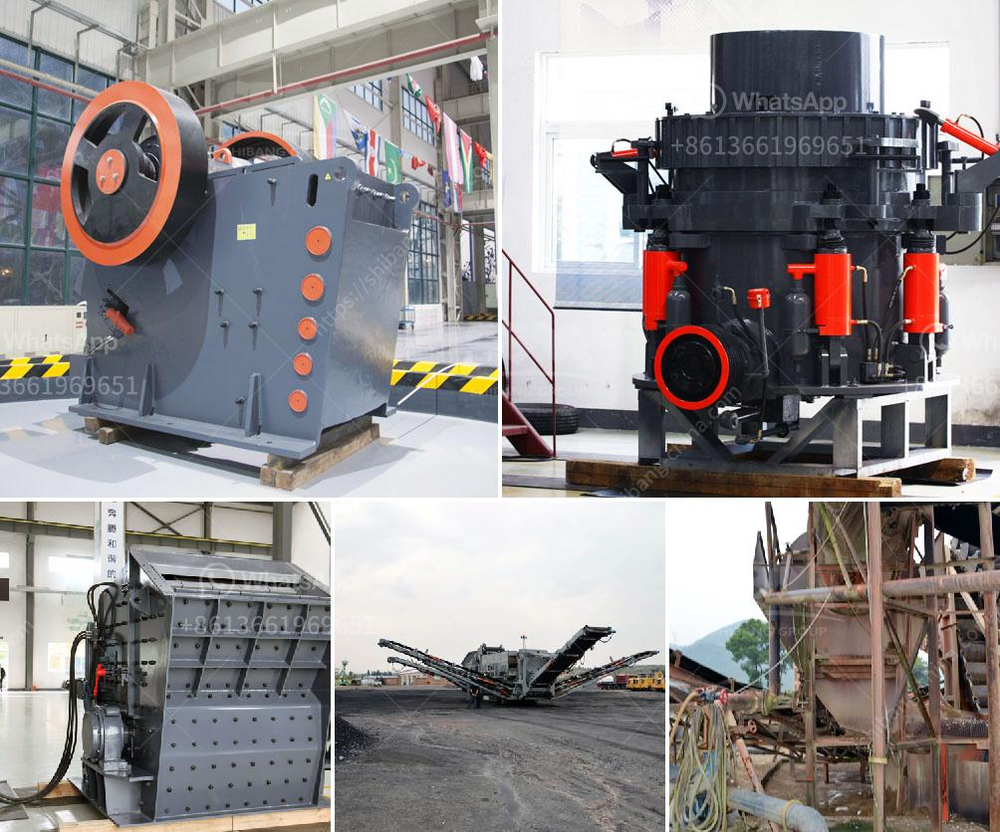

<h3>gemstone mining and processing machine</h3>
Gemstone mining and processing machines are used in the mining and processing industry to quickly and efficiently extract and process gemstones. Gemstones are naturally occurring minerals that are prized for their beauty, rarity, and durability. These precious stones are used in jewelry-making, but they also have industrial applications.

In the mining process, gemstones are extracted from the earth through various methods such as open-pit or underground mining. Once the gemstones are extracted, they undergo a series of processes to be transformed into their final form. This includes cleaning, cutting, shaping, and polishing.

Gemstone mining and processing machines play a crucial role in these operations. These machines are designed to handle the tough and demanding conditions of gemstone mining, ensuring maximum efficiency and productivity. They can handle large quantities of raw material, extract gemstones from the earth, and transport them for further processing.

One popular gemstone mining and processing machine is the rock saw. This machine uses a diamond saw blade to cut through tough rock formations, allowing miners to access gemstone deposits. Other machines include water jets that use high-pressure water to remove dirt and debris from gemstone-bearing rocks.

The processing machines also play a vital role. These machines include tumblers and grinders, which are used to shape and polish gemstones. Tumblers use rotating barrels or vibrating screens to smooth and polish the gemstones, while grinders use grinding wheels to shape them into the desired form.

Gemstone mining and processing machines not only increase productivity and efficiency but also reduce the risk of human error and injury. These machines are designed with advanced technologies and safety features to ensure the well-being of workers.

In conclusion, gemstone mining and processing machines are essential tools in the mining and processing industry. They enable the extraction and transformation of gemstones from raw material to the final product. These machines not only increase efficiency and productivity but also ensure the safety of workers. With the use of these machines, the gemstone industry can continue to thrive and provide consumers with beautiful and valuable gemstones.
<h3>Contact us</h3><ul><li><strong>Whatsapp:&nbsp;<a href="https://wa.me/8613661969651">+8613661969651</a></strong></li><li><a href="https://swt.shibang-china.com/?git&amp;zhl&amp;gemstone mining and processing machine"><strong>Online Service(chat now)</strong></a></li></ul><h3>Related</h3><ul><li><a href='limestone jaw crusher for sale.md'>limestone jaw crusher for sale</a></li><li><a href='calcite crusher machine.md'>calcite crusher machine</a></li><li><a href='ultra fine grinding mill for limestone.md'>ultra fine grinding mill for limestone</a></li><li><a href='pulveriser with single pot.md'>pulveriser with single pot</a></li><li><a href='sand mining for construction in equatorial guinea.md'>sand mining for construction in equatorial guinea</a></li></ul>