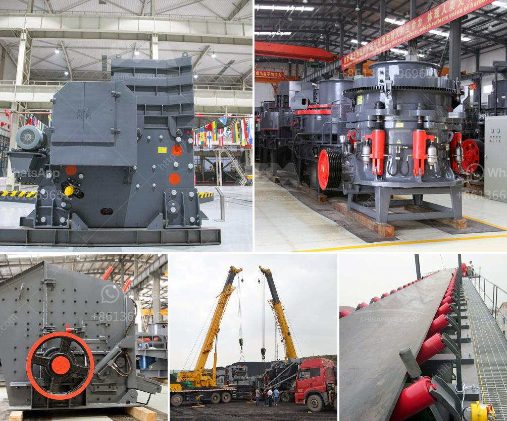

<h3>german jaw crusher manufacturers</h3>
Germany’s mining equipment manufacturers have come out of recession. Following a decline in turnover of some 21% down to €2.8 billion this year, the sector foresees stabilization in 2017. In 2018, things should pick up once again. Looking domestically, a decline in turnover of 36% down to €210 million is anticipated for this year. Revenue abroad will fall more slightly at 2.5% to €1.86 billion. In future, the domestic market will grow at just 1% annually. 

There are many jaw crusher manufacturers in Germany, of which DSMAC is a high-tech enterprise specialized in developing and researching all kinds of crushing equipment. 

The PE series jaw crusher produced by DSMAC, the best choice for primary crushing, is equipped with advanced technology to effectively guarantee its high crushing efficiency perofrmance. Today, DSMAC, the professional jaw crusher manfacturer, brings us the richer benefits through the German expert of Shibang. In forida, we recommend the PEW jaw crusher for you. 

With the high-tech design of Germany, the jaw crusher plant has already become the most popular crushing equipment in the world and it has taken the lead in the crushing industry. There are several types of jaw crusher equipment available to choose from. PEW series jaw crusher is called as universal mining crusher due to its versatility. It is mainly suitable for crushing various ores and large blocks of stone. PE series jaw crusher is usually used as primary crusher in quarry production lines, mineral ore crushing plants and powder making plants. 

With the continuous innovation in the industry, jaw crushers are equipped with hydraulic or manual adjustment of the discharge port, making them more secure and efficient in the crushing process.

German jaw crusher manufacturers will usher in a new development opportunities, supplier of jaw crusher plate in india can be said to be in a reasonably competitive market, thereby increasing the cost of production, in fact, the price of the jaw crusher for sale depends on the cost invested in the production line. 

The rapid advancement of technology and the increasing demand for equipment in the market will also propel the development of the jaw crusher market. Therefore, the trend of technology and the future development of the jaw crusher market will be conducive to the continuing advancement of the industry. 

In conclusion, Germany’s jaw crusher manufacturers are actively driving the industry forward, with Germany’s economy thriving on their consistent presence in the market. Increasing exports of the jaw crusher machines have led to an increase in production and added revenue for the companies. Whereas, with the economic slowdown in regions such as Russia, China, and Brazil, Germany has staked its claim as Europe’s top exporter of jaw crushers.
<h3>Contact us</h3><ul><li><strong>Whatsapp:&nbsp;<a href="https://wa.me/8613661969651">+8613661969651</a></strong></li><li><a href="https://swt.shibang-china.com/?git&amp;zhl&amp;german jaw crusher manufacturers"><strong>Online Service(chat now)</strong></a></li></ul><h3>Related</h3><ul><li><a href='coal dry processing plant.md'>coal dry processing plant</a></li><li><a href='carbomer ball mill.md'>carbomer ball mill</a></li><li><a href='stone crusher machine in kenya.md'>stone crusher machine in kenya</a></li><li><a href='price of stone crusher machine in nigeria.md'>price of stone crusher machine in nigeria</a></li><li><a href='24 36 jaw crusher for sale usa.md'>24 36 jaw crusher for sale usa</a></li></ul>