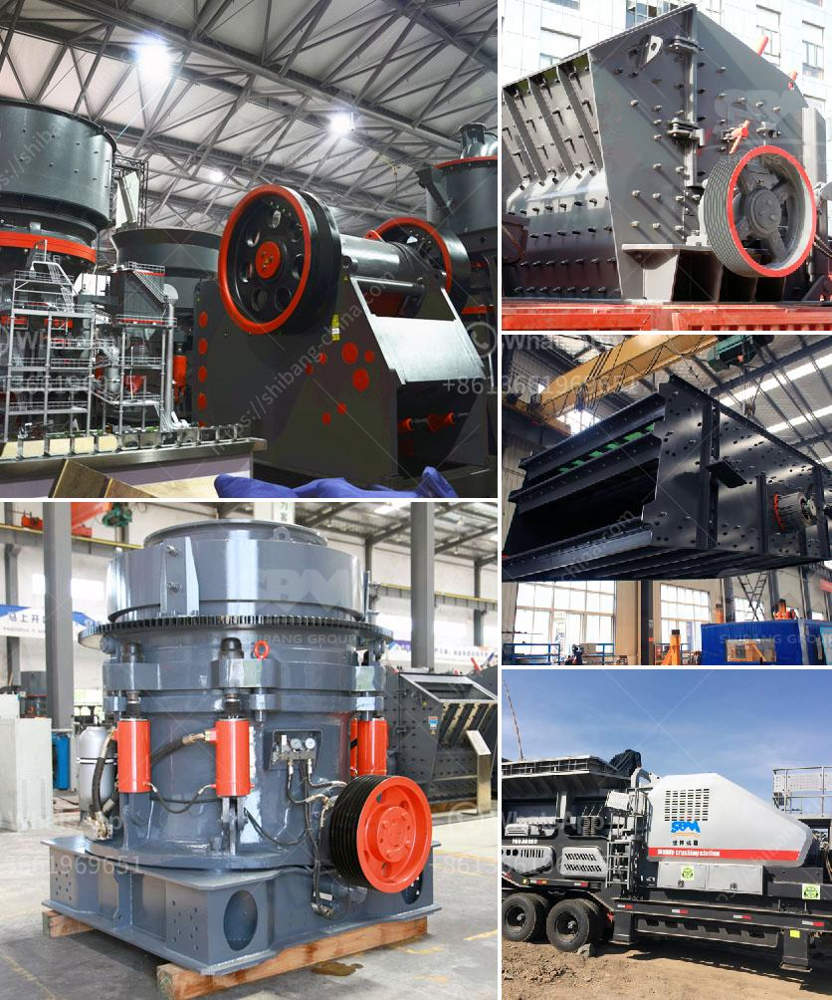

<h3>german zenith made mobile stone crusher</h3>
The German zenith mobile stone crusher is a perfect amalgamation of craftsmanship and innovation that combines sturdy construction with immaculate design for enhanced performance and durability. The cutting-edge design of this crusher can be attributed to German engineering and technology, making it an efficient and reliable solution for a variety of crushing needs.

This zenith mobile stone crusher is compact and easy to handle, eliminating the need for transportation permits. It boasts a flexible configuration and can be operated without using a truck or heavy machinery. The crusher can be easily moved around, making it suitable for various construction projects or quarry operations.

The zenith mobile stone crusher offers high-quality crushing performance, with minimal downtime and maximum productivity. Its jaw crusher guarantees maximum crushing capacity in both primary crushing and secondary crushing processes. The cone crusher ensures excellent reduction ratios, and the VSI crusher offers efficient shaping of the stones.

One of the key advantages of the zenith mobile stone crusher is its fuel-efficient engine, which can be continuously operated for many hours. This crusher also features a user-friendly control panel with intuitive navigation, making it effortless to operate. Operators can easily adjust the settings for different crushing requirements, ensuring optimal output and reduced wear on the machine.

The zenith mobile stone crusher features a compact, lightweight design that is easy to transport, ensuring utmost convenience and efficiency during operation. It can be assembled within a short time, thanks to its quick setup process. The crusher is equipped with hydraulic legs, offering excellent stability on any terrain.

Safety is a top priority for zenith, and this mobile stone crusher is packed with advanced safety features. The crusher is equipped with a remote control that allows the operator to monitor and control the machine from a safe distance. It also includes various safety devices, such as an emergency stop button and an automatic lubrication system to prevent any accidents or breakdowns.

Additionally, the zenith mobile stone crusher is built to last, with high-quality materials and components. It undergoes rigorous testing and quality checks to ensure its reliability and durability, even in harsh operating conditions. The crusher's parts are easily replaceable, minimizing downtime and reducing maintenance costs.

In conclusion, the German zenith mobile stone crusher combines exceptional performance, efficiency, and versatility in a compact package. It is a reliable solution for various crushing applications, offering high-quality output, fuel efficiency, and ease of operation. Whether used in construction projects or quarry operations, this crusher provides a cost-effective and sustainable solution for crushing stones. With German engineering excellence and innovative technology, the zenith mobile stone crusher sets new standards in the industry.
<h3>Contact us</h3><ul><li><strong>Whatsapp:&nbsp;<a href="https://wa.me/8613661969651">+8613661969651</a></strong></li><li><a href="https://swt.shibang-china.com/?git&amp;zhl&amp;german zenith made mobile stone crusher"><strong>Online Service(chat now)</strong></a></li></ul><h3>Related</h3><ul><li><a href='slag processing plant manufacturers in chile.md'>slag processing plant manufacturers in chile</a></li><li><a href='jaw crusher in german.md'>jaw crusher in german</a></li><li><a href='portable ballast crusher for sale.md'>portable ballast crusher for sale</a></li><li><a href='crushing and screening process.md'>crushing and screening process</a></li><li><a href='300 tph jaw crusher.md'>300 tph jaw crusher</a></li></ul>