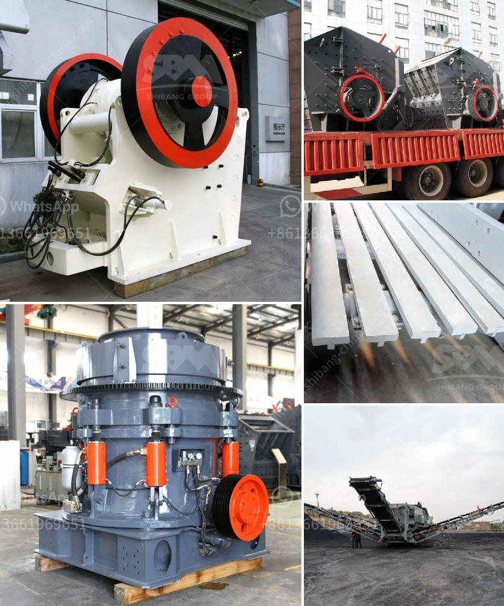

<h3>germany calcium carbonate grinding mill suppliers</h3>
Calcium carbonate grinding mill is one of the most commonly used industrial milling equipment. It is widely used in calcium carbonate processing plants. However, due to different grinding principles and different fineness of finished products, there are many calcium carbonate grinding mill suppliers on the market. Among them, there are both comprehensive suppliers and specialized suppliers. Today, we will introduce several Germany calcium carbonate grinding mill suppliers for reference.

As a professional manufacturer of grinding mills, CLIRIK can provide various types of grinding machineries for calcium carbonate processing. For example, calcite grinding mill, limestone grinding mill, talc grinding mill, dolomite grinding mill, etc. CLIRIK has advanced technology, strict production process, and excellent after-sales service to ensure the quality of its products. The equipment produced by CLIRIK is not only of high quality, but also has a large output, which can meet the needs of different customers.

HGM series grinding mills are products of Shanghai Clirik Machinery Co., Ltd. It is suitable for grinding calcium carbonate, barite, dolomite, calcite, limestone, kaolin, bentonite, marble, gypsum, quartz, feldspar, clay, talc, fluorite, clay, white mud, mica, refractory materials, glass, total about 1000 kinds of materials. Their final product size can be adjusted between 20mesh and 2500mesh (0.074-0.005mm).

Vostosun Industrial Co., Ltd. is a mining machinery company located in Shanghai, China. They have been providing customers with a variety of mineral processing equipment and services for more than 10 years. The equipment includes ball mills, jaw crushers, magnetic separators, flotation machines, rotary dryers, etc. In addition, they can also provide plant design and construction services. Vostosun focuses on the calcium carbonate grinding mill field, and its equipment has been widely used in more than 80 countries and regions around the world.

Shanghai Clirik Machinery Co., Ltd. specializes in R&D, production, sales, and service of various mining machinery and equipment, including grinding mills. They focus on the research and development of calcium carbonate grinding mills, and their equipment has been widely used in the grinding and processing of calcium carbonate, coating materials, paint, paper, rubber, plastics, chemicals, building materials, medicine, food and other industries.

In conclusion, when choosing calcium carbonate grinding mill suppliers, it is necessary to consider the reputation and strength of the supplier, the quality of the equipment, the after-sales service and other aspects. The above mentioned Germany calcium carbonate grinding mill suppliers provide a wide range of grinding mill machines for customers to choose from.
<h3>Contact us</h3><ul><li><strong>Whatsapp:&nbsp;<a href="https://wa.me/8613661969651">+8613661969651</a></strong></li><li><a href="https://swt.shibang-china.com/?git&amp;zhl&amp;germany calcium carbonate grinding mill suppliers"><strong>Online Service(chat now)</strong></a></li></ul><h3>Related</h3><ul><li><a href='powder making machine.md'>powder making machine</a></li><li><a href='used 34 ssi shredder united states.md'>used 34 ssi shredder united states</a></li><li><a href='stone crusher machinery turkey.md'>stone crusher machinery turkey</a></li><li><a href='grinding mill tecator cyclotec.md'>grinding mill tecator cyclotec</a></li><li><a href='cement plant process flow diagram ppt.md'>cement plant process flow diagram ppt</a></li></ul>