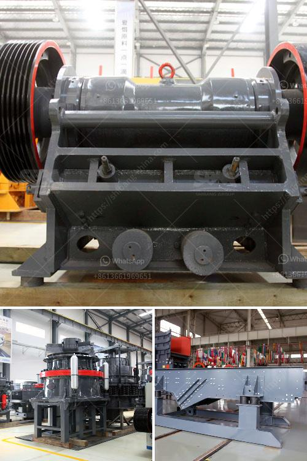

<h3>germany rocks crushers</h3>
Germany is known for its engineering prowess and high-quality machinery, and its rock crushers are no exception. These crushers play a vital role in the mining industry, as they help break down large rocks into smaller, more manageable pieces. With their robust construction and powerful performance, Germany's rock crushers have become a staple in mining operations worldwide.

One of the key factors that set German rock crushers apart from others is their durability and reliability. German engineering is renowned for its precision and attention to detail, and these principles are reflected in the design and construction of rock crushers. Manufacturers in Germany use the finest quality materials and craftsmanship to ensure that their machines can withstand the harshest conditions and deliver optimal performance.

Another distinguishing feature of German rock crushers is their advanced technology. Germany has a long history of innovation and is constantly pushing the boundaries of technology. German manufacturers equip their crushers with cutting-edge features such as hydraulic systems, high-speed eccentric bearings, and advanced control systems. These technological advancements enable the crushers to deliver excellent productivity and efficiency, resulting in increased output and reduced downtime.

Furthermore, German rock crushers are known for their versatility. They can handle a wide range of rock types, from soft limestone to hard granite, and everything in between. This versatility allows operators to use a single crusher for various applications, saving both time and money. Whether it's crushing large boulders for road construction or processing smaller rocks for aggregate production, Germany's rock crushers can perform reliably and efficiently.

In addition to their robustness, advanced technology, and versatility, German rock crushers also prioritize safety. Germany has stringent safety regulations in place, and manufacturers comply with these regulations to ensure the well-being of operators. These crushers are equipped with safety features such as emergency stop buttons, protective guards, and interlocking systems to prevent accidents and injuries.

Germany's rock crushers have gained a solid reputation not only for their exceptional performance but also for their environmental friendliness. Manufacturers in Germany are committed to sustainable practices and strive to minimize the impact of their machines on the environment. They incorporate features such as low emissions engines, noise reduction systems, and dust suppression measures to ensure that their crushers comply with stringent environmental regulations.

In conclusion, Germany's rock crushers are a testament to the country's engineering excellence. With their durability, advanced technology, versatility, and commitment to safety and sustainability, these crushers have solidified their position as industry leaders. Whether used in mining, construction, or quarrying operations, German rock crushers deliver superior performance, boosting productivity, and reducing costs.
<h3>Contact us</h3><ul><li><strong>Whatsapp:&nbsp;<a href="https://wa.me/8613661969651">+8613661969651</a></strong></li><li><a href="https://swt.shibang-china.com/?git&amp;zhl&amp;germany rocks crushers"><strong>Online Service(chat now)</strong></a></li></ul><h3>Related</h3><ul><li><a href='stacker conveyors suppliers.md'>stacker conveyors suppliers</a></li><li><a href='simple diagram for high energy ball milling.md'>simple diagram for high energy ball milling</a></li><li><a href='gold hammer mills in harare zimbabwe.md'>gold hammer mills in harare zimbabwe</a></li><li><a href='price of a stone crusher.md'>price of a stone crusher</a></li><li><a href='mobile stone crusher price philippines.md'>mobile stone crusher price philippines</a></li></ul>