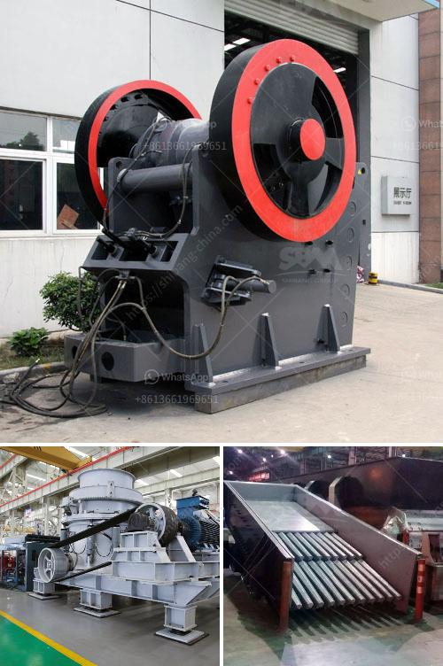

<h3>gold crusher philippines</h3>
The Philippines is one of the countries known for being rich in natural resources, including gold. In fact, the country is ranked as the world's second-largest gold producer. With such a vast amount of gold available, it is no wonder that the Philippines has a thriving gold mining industry. One crucial piece of equipment that is essential in gold mining is the gold crusher.

A gold crusher, also known as a gold ore crusher, is a machine used to process gold ore into smaller pieces, ensuring that the gold can be easily extracted and separated from the surrounding materials. There are various types of gold crushers available in the Philippines, such as jaw crushers, cone crushers, impact crushers, and even portable crushers.

One popular gold crusher in the Philippines is the jaw crusher. This is a versatile and highly reliable equipment that offers a large crushing ratio and high production capacity. It is designed to crush even the hardest and most abrasive materials, making it ideal for mining operations. The jaw crusher is capable of crushing gold ore up to 300mm, reducing it to 25mm or smaller.

Another type of gold crusher commonly used in the Philippines is the cone crusher. Unlike the jaw crusher, the cone crusher is more suited for secondary or tertiary crushing. It is designed to crush a variety of materials, including gold ore, limestone, basalt, granite, and other similar materials. The cone crusher can produce particles as small as 5mm, ensuring the efficient extraction of gold from the ore.

The impact crusher is also widely used in the gold mining industry. It is a versatile and powerful machine that delivers high reduction ratios. The impact crusher is designed to crush materials with a maximum feed size of 500mm and a compressive strength of up to 350MPa. It is commonly used to process gold-bearing rocks and ores, as well as other materials such as concrete and asphalt.

For those in remote areas or small-scale gold mining operations, portable crushers are often the best option. Portable crushers are mobile machines that can be easily transported to the mining site. They are designed to crush gold ore on-site, eliminating the need for costly transportation of materials. Portable crushers are compact and easy to operate, making them suitable for small-scale miners who may not have access to heavy-duty machinery.

In conclusion, the gold crusher is an essential piece of equipment in the gold mining industry. It helps process gold ore into smaller pieces, making it easier to extract and separate the valuable metal from other materials. Whether it's a jaw crusher, cone crusher, impact crusher, or portable crusher, each type offers advantages and benefits for different mining operations. With the Philippines being a gold-rich country, investing in a reliable and efficient gold crusher is crucial for maximizing profits and ensuring sustainable mining practices.
<h3>Contact us</h3><ul><li><strong>Whatsapp:&nbsp;<a href="https://wa.me/8613661969651">+8613661969651</a></strong></li><li><a href="https://swt.shibang-china.com/?git&amp;zhl&amp;gold crusher philippines"><strong>Online Service(chat now)</strong></a></li></ul><h3>Related</h3><ul><li><a href='quarry business plan.md'>quarry business plan</a></li><li><a href='granite edge cutting machine in sweden.md'>granite edge cutting machine in sweden</a></li><li><a href='iron ore beneficiation technology.md'>iron ore beneficiation technology</a></li><li><a href='linear vibrating screener nigeria.md'>linear vibrating screener nigeria</a></li><li><a href='india manufacturers for small ball mills.md'>india manufacturers for small ball mills</a></li></ul>