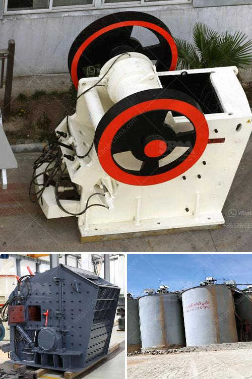

<h3>gold hammer mill</h3>
In the gold mining industry, the need for efficient and reliable processing equipment is paramount. One of the key components in any gold recovery operation is the gold hammer mill. These mills are designed to pulverize and grind ore into a fine slurry or powder in preparation for the next stage of processing.

The gold hammer mill works by using a high-speed rotor to pulverize the ore into small particles. It acts as a mechanical sieve to separate larger pieces of ore from smaller particles, allowing the valuable gold-containing material to be extracted and processed further. This finely ground material can then be treated with chemicals, such as cyanide, to extract the gold particles.

The hammer mill is a versatile piece of machinery that can perform several tasks. It can be used as a primary crusher to break down larger pieces of ore into smaller particles that can be processed further. Additionally, it can be used as a secondary crusher to further reduce the size of the crushed material, increasing the efficiency of the gold recovery process.

One advantage of using a hammer mill is its ability to produce a wide range of particle sizes. Unlike other crushing and grinding equipment, the gold hammer mill can be adjusted to produce different particle sizes, allowing miners to refine their techniques based on the specific composition of the ore they are processing. This flexibility is crucial as it maximizes the recovery of gold particles.

Furthermore, the gold hammer mill is a relatively low-cost investment, making it an attractive option for small-scale miners. It requires minimal maintenance and has a long lifespan, ensuring that it can withstand the harsh operating conditions commonly found in gold mining operations. This durability is essential to minimize downtime and maximize production.

Another benefit of the gold hammer mill is its portability. It can be easily transported to and from mining sites, allowing miners to access remote areas where rich gold deposits may be located. This mobility is crucial as it enables miners to quickly set up and start processing ore, reducing the time and effort required to extract gold.

In conclusion, the gold hammer mill is a vital piece of equipment for miners in the gold mining industry. It provides an efficient and cost-effective method for processing gold ore, allowing miners to maximize their returns and minimize the environmental impact. With its versatility, durability, and portability, the gold hammer mill is an essential tool for any gold recovery operation.
<h3>Contact us</h3><ul><li><strong>Whatsapp:&nbsp;<a href="https://wa.me/8613661969651">+8613661969651</a></strong></li><li><a href="https://swt.shibang-china.com/?git&amp;zhl&amp;gold hammer mill"><strong>Online Service(chat now)</strong></a></li></ul><h3>Related</h3><ul><li><a href='crushing machine price.md'>crushing machine price</a></li><li><a href='crushing machine manufacturers.md'>crushing machine manufacturers</a></li><li><a href='how to build a garnet wash plant.md'>how to build a garnet wash plant</a></li><li><a href='portable crushing line.md'>portable crushing line</a></li><li><a href='iron ore crushing process.md'>iron ore crushing process</a></li></ul>