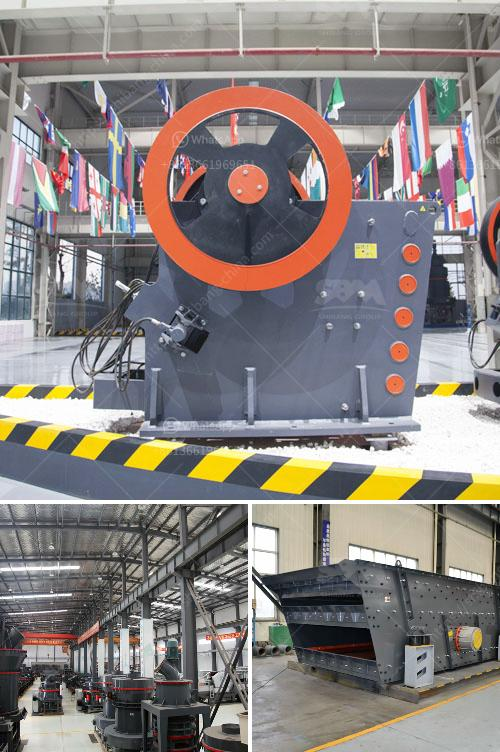

<h3>gold hammer mills for sale south africa</h3>
Gold hammer mills for sale south africa are a leading investment in today's marketplace. They are a desirable option for any miner, whether small-scale or large-scale, as they possess long-lasting durability and exceptional productivity. With the cost of gold skyrocketing, investing in gold hammer mills is a wise choice that could potentially yield substantial returns.

In South Africa, the gold mining industry has been a key contributor to the country's economy. Gold hammer mills are an essential tool for any miner looking to extract gold from the ground. The process typically involves crushing or pulverizing the gold ore before extracting the precious metal. The gold hammer mill is a crucial piece of equipment that allows miners to quickly and efficiently process gold ore and extract the gold they desire.

One of the advantages of utilizing gold hammer mills in South Africa is their ability to produce a fine grind. This enhances the efficiency of the extraction process by ensuring that all particles of gold are reached and extracted. In addition, these mills are versatile and can handle various types of ore, making them suitable for miners with different gold ore deposits.

Finding gold hammer mills for sale in South Africa is relatively easy. There are numerous suppliers and manufacturers that offer these machines. It is essential to choose a reputable and reliable supplier to ensure that the equipment meets the necessary standards and will provide excellent performance. Furthermore, it is crucial to consider factors such as warranty, after-sales service, and spare parts availability when making a purchase.

Investing in gold hammer mills in South Africa offers the opportunity for miners to capitalize on the ever-increasing demand for gold. With proper maintenance and care, these mills can provide dependable and efficient performance for years to come. Whether you are a small-scale miner looking to expand or a large-scale operation seeking greater productivity, gold hammer mills present a lucrative investment opportunity.

In conclusion, gold hammer mills for sale in South Africa are an excellent investment option for miners seeking to maximize their gold extraction process. These mills provide efficient pulverization, fine grinding capability, and versatile functionality. Finding a reputable supplier is crucial to ensure the quality and longevity of the equipment. By investing in gold hammer mills, miners can potentially achieve significant returns while contributing to the growth and stability of the South African economy.
<h3>Contact us</h3><ul><li><strong>Whatsapp:&nbsp;<a href="https://wa.me/8613661969651">+8613661969651</a></strong></li><li><a href="https://swt.shibang-china.com/?git&amp;zhl&amp;gold hammer mills for sale south africa"><strong>Online Service(chat now)</strong></a></li></ul><h3>Related</h3><ul><li><a href='alluvial gold plants for sale south africa.md'>alluvial gold plants for sale south africa</a></li><li><a href='gold separating machine for sale in south africa.md'>gold separating machine for sale in south africa</a></li><li><a href='crusher in antioquia stone crusher.md'>crusher in antioquia stone crusher</a></li><li><a href='used ez screen plant 1200 xl for sale.md'>used ez screen plant 1200 xl for sale</a></li><li><a href='suppliers of chromite sand from south africa.md'>suppliers of chromite sand from south africa</a></li></ul>