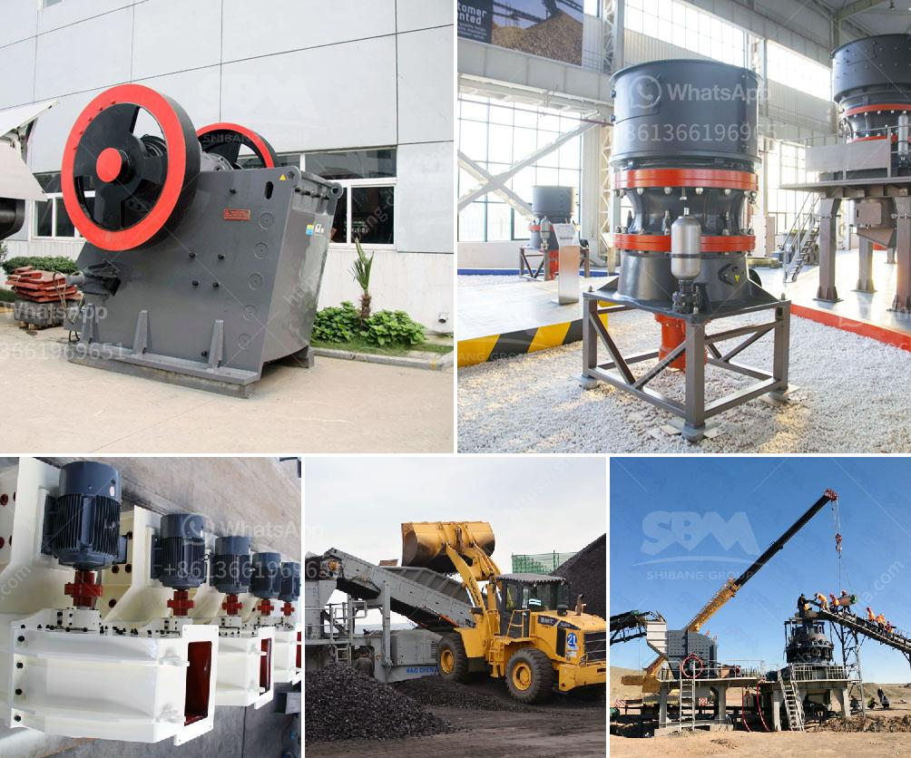

<h3>gold hammer mills in harare zimbabwe</h3>
Gold hammer mills in Harare Zimbabwe may help you provide a complete and reliable gold milling solution for producing high-quality gold ore powder. While designing a gold hammer mill, we mainly focus on the following factors:

1. Feed rate: The feed rate of the machine determines its grinding capacity. It plays a significant role in grinding efficiency and output. A higher feed rate allows more material to be processed, increasing productivity and reducing processing time.

2. Rotor speed: The rotor speed controls the impact force of the hammers on the material. A higher rotor speed can result in more intense impact and grinding, accelerating the milling process. However, it is important to find a balance between speed and the fineness of the processed material.

3. Hammer size and configuration: The size and configuration of the hammers impact the efficiency and fineness of the milling process. Different hammer designs can be utilized based on the specific requirements of the ore material. Additionally, robust hammers made from durable materials have a longer lifespan, reducing maintenance costs.

4. Screen size: The size of the screen determines the size of the final product. Choosing the appropriate screen size ensures that the final gold ore powder meets the desired specifications. Too small a screen may result in the loss of valuable fine gold particles while too large a screen can cause inefficient grinding and oversized particles.

5. Motor power: The motor power is crucial for stable and efficient operation of the gold hammer mill. It is important to select a motor with adequate horsepower to handle the grinding workload effectively. Additionally, energy-efficient motors can lower operational costs in the long run.

6. Dust control mechanisms: Dust generated during the gold milling process can pose health risks and damage equipment. Implementing effective dust control mechanisms, such as dust collection systems or using water sprays, helps reduce the impact of dust on workers' health and prolongs the lifespan of the hammer mill.

Gold hammer mills in Harare, Zimbabwe, provide a reliable solution for gold milling, ensuring high productivity, efficiency, and quality. These mills are specifically designed to pulverize and grind gold ores into fine particles. They are an essential tool for Zimbabwean gold miners who seek to extract valuable gold resources efficiently.

Investing in gold hammer mills not only benefits individual miners but also promotes economic development in the regions where the mills are located. By using locally manufactured equipment, the mining industry contributes to local job creation and supports the growth of other industries that rely on gold mining.

In conclusion, gold hammer mills in Harare, Zimbabwe, are essential tools for mining companies and individuals seeking to extract and process gold ore efficiently. Factors such as feed rate, rotor speed, hammer size and configuration, screen size, motor power, and dust control mechanisms determine the efficiency and quality of the milling process. By investing in these mills, miners can maximize their gold output, contribute to local economic development, and ensure sustainable mining practices.
<h3>Contact us</h3><ul><li><strong>Whatsapp:&nbsp;<a href="https://wa.me/8613661969651">+8613661969651</a></strong></li><li><a href="https://swt.shibang-china.com/?git&amp;zhl&amp;gold hammer mills in harare zimbabwe"><strong>Online Service(chat now)</strong></a></li></ul><h3>Related</h3><ul><li><a href='business plan for a quarry.md'>business plan for a quarry</a></li><li><a href='how much does it cost to set up a mini cement plant.md'>how much does it cost to set up a mini cement plant</a></li><li><a href='primary stone crusher.md'>primary stone crusher</a></li><li><a href='roll crusher used equipment tph coal russian.md'>roll crusher used equipment tph coal russian</a></li><li><a href='complete gold refinery for sale in south africa.md'>complete gold refinery for sale in south africa</a></li></ul>