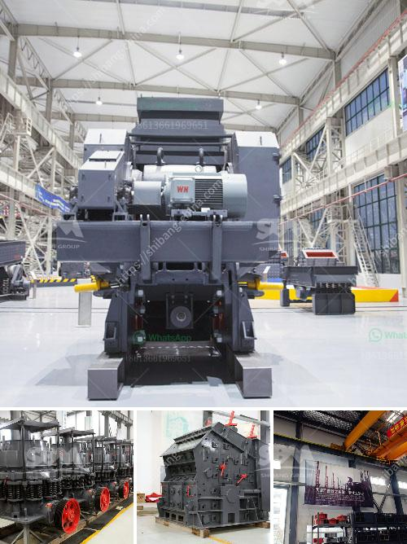

<h3>gold mill tailings processing equipment</h3>
Gold mill tailings are the by-products generated during the processing of gold-bearing ores after the extraction process has taken place. They consist of finely crushed rock particles that are left after the gold has been extracted from the ore. These tailings can be hazardous if not managed properly, as they often contain harmful materials such as mercury and cyanide.

In recent years, there has been a growing interest in developing efficient and environmentally friendly methods for processing gold mill tailings. This is mainly driven by the fact that traditional methods of processing these tailings, such as gravity concentration and cyanide leaching, are not only expensive but also have a significant impact on the environment.

To address this issue, various technologies and equipment have been developed to process gold mill tailings. One such equipment is the gold mill tailings processing equipment, which is a portable system that allows the recovery of gold from tailings, concentrated gold-bearing materials, and ores. This innovative technology employs a series of mechanical and chemical processes to achieve the desired outcome.

The gold mill tailings processing equipment has a high recovery rate, low energy consumption, ultra-fine grinding, and a small area occupation. The global market demand for this equipment is driven by the increasing need to process low-grade ores and tailings from mining operations.

The gold mill tailings processing equipment can process ore into various sizes of sand and stone aggregates, separate ore tailings, liberation of gold particles from impurities, recover gold from forceful tailings, and reduce the tailings’ moisture content. The equipment is automated, efficient, and very easy to operate, making it suitable for both small and large-scale mining operations.

One of the primary advantages of using gold mill tailings processing equipment is its ability to reclaim and reuse the water used during the process. This reduces the need for fresh water and minimizes the environmental impact associated with water consumption. Additionally, it reduces the amount of tailings generated, minimizing the overall environmental footprint of mining operations.

Moreover, using this equipment helps recover valuable minerals that may have been missed during the initial processing of the ore. It also eliminates the need for the construction and maintenance of tailings dams, which can be expensive and pose environmental risks.

In conclusion, gold mill tailings processing equipment plays a crucial role in the sustainable and efficient processing of gold mill tailings. It offers a cost-effective solution for separating gold from the surrounding materials, while also minimizing the environmental impact of mining operations. The use of such equipment helps recover valuable minerals, reduces water consumption, and eliminates the need for tailings dams. As the demand for gold mill tailings processing equipment increases, its technology continues to evolve, bringing more effective and efficient solutions to the mining industry.
<h3>Contact us</h3><ul><li><strong>Whatsapp:&nbsp;<a href="https://wa.me/8613661969651">+8613661969651</a></strong></li><li><a href="https://swt.shibang-china.com/?git&amp;zhl&amp;gold mill tailings processing equipment"><strong>Online Service(chat now)</strong></a></li></ul><h3>Related</h3><ul><li><a href='how many kg in 1 cubic feet of 20mm crusher stone.md'>how many kg in 1 cubic feet of 20mm crusher stone</a></li><li><a href='rock crusher design.md'>rock crusher design</a></li><li><a href='used 500 tph stone crusher prices.md'>used 500 tph stone crusher prices</a></li><li><a href='ball mill for ceramic tile factory.md'>ball mill for ceramic tile factory</a></li><li><a href='complete gold refinery for sale in south africa.md'>complete gold refinery for sale in south africa</a></li></ul>