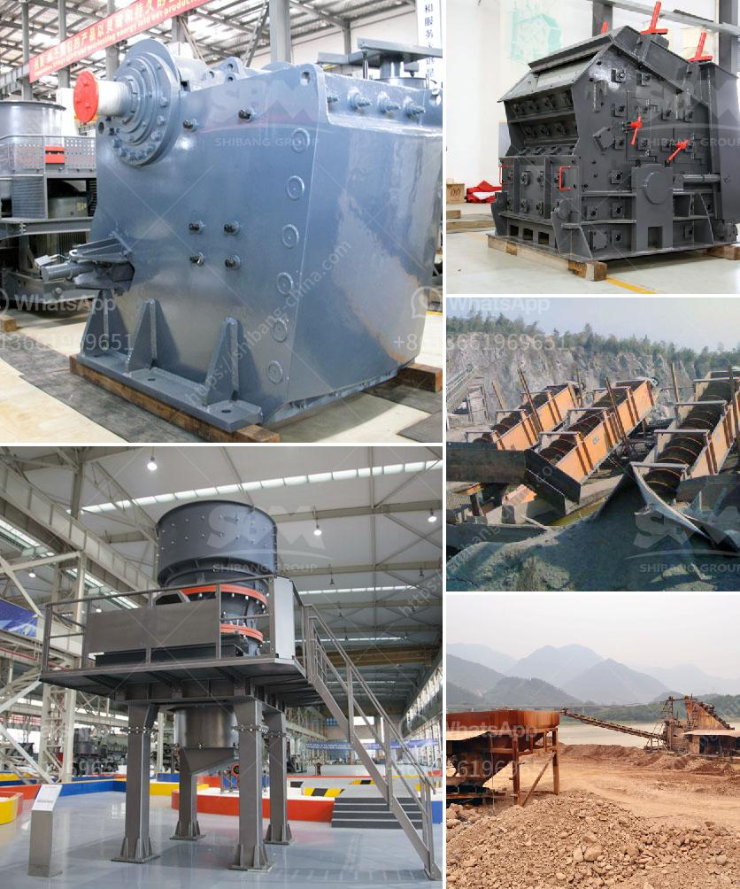

<h3>gold mining crusher machinery</h3>
Gold mining is a lucrative endeavor that has been practiced for centuries. In recent years, the demand for gold has significantly increased due to the rise in global economic instability. Like any other industry, the success of gold mining operations is largely dependent on efficient and reliable machinery. One crucial piece of equipment in the gold mining industry is the crusher machinery.

Crusher machinery is designed to break down hard materials, such as granite, into smaller and more manageable pieces. Crushing equipment is often used in mining operations to ensure that the extracted ore is crushed to the required size for further processing. Various types of crushers are available in the market, each with different features and capabilities.

One popular type of crusher machinery used in gold mining is the impact crusher. This machine is widely used in a variety of industries, including mining and construction. It provides high-speed impact with solid resistance to wear, enabling it to crush various materials quickly. The impact crusher is also known for its ability to produce a consistently graded product, making it ideal for gold mining operations.

Another commonly used crusher machinery in gold mining is the jaw crusher. This machine is often used in the first stage of the gold mining process. Jaw crushers are robust machines that are known for their ability to crush extremely hard materials, such as ores containing gold. It features a large crushing chamber, which allows for efficient processing and minimal downtime.

Cone crushers are also widely utilized in the gold mining industry. They offer several advantages, including high productivity, excellent particle shape, and low operation costs. Cone crushers are often used for secondary and tertiary crushing stages and can be easily integrated into existing processing plants. Their ability to crush hard and abrasive materials makes them highly suitable for gold mining operations.

In recent years, technological advancements have led to the development of more specialized crusher machinery for gold mining. For instance, mobile crushers are now available, allowing mining operations to move their crushing plants to remote locations more easily. Additionally, advancements in automation and control systems have improved the efficiency and safety of crusher machinery.

It is important for gold miners to invest in high-quality crusher machinery to ensure the success of their operations. By using reliable and efficient equipment, they can reduce downtime, increase productivity, and improve overall profitability. Regular maintenance and inspection of crusher machinery are also crucial to prevent costly breakdowns and extend the lifespan of the equipment.

In conclusion, crusher machinery plays a vital role in the gold mining industry. It enables miners to extract and process gold ore efficiently and reliably. Various types of crushers, such as impact crushers, jaw crushers, and cone crushers, are commonly used in the industry. Advancements in technology have led to the development of more specialized and efficient crusher machinery. Investing in high-quality equipment and proper maintenance are essential to maximize productivity and profitability in gold mining operations.
<h3>Contact us</h3><ul><li><strong>Whatsapp:&nbsp;<a href="https://wa.me/8613661969651">+8613661969651</a></strong></li><li><a href="https://swt.shibang-china.com/?git&amp;zhl&amp;gold mining crusher machinery"><strong>Online Service(chat now)</strong></a></li></ul><h3>Related</h3><ul><li><a href='screen clay from limestone rock.md'>screen clay from limestone rock</a></li><li><a href='sand making machine from china.md'>sand making machine from china</a></li><li><a href='portable hydraulic rock crusher.md'>portable hydraulic rock crusher</a></li><li><a href='grinding mill material.md'>grinding mill material</a></li><li><a href='cone crusher hp 300.md'>cone crusher hp 300</a></li></ul>