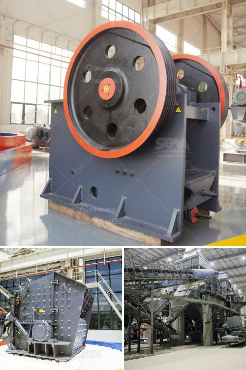

<h3>gold mining equipment for sale in singapore</h3>
Gold mining equipment is essential for both small and large-scale gold extraction operations. With gold prices consistently reaching new highs, the demand for mining equipment has never been greater. Whether it is for commercial or personal use, gold mining equipment is necessary for extracting gold from the earth.

Singapore, although not known for its gold mines, has become a hub for gold trading and investment. As a result, the demand for gold mining equipment in Singapore has seen a sharp rise. Fortunately, there are several reliable suppliers and retailers in Singapore that offer a wide range of gold mining equipment for sale.

One of the most critical pieces of equipment in gold mining is the prospecting metal detector. These handheld devices are used to detect the presence of gold nuggets, flakes, and dust in the ground. Metal detectors vary in complexity and price range, allowing both novice and professional miners to find the detector that suits their needs and budget.

Another essential piece of equipment is the gold pan, which is used to separate gold particles from other sediments and minerals in rivers and streams. Gold pans are available in various sizes and shapes to cater to different mining conditions. They are typically made from sturdy materials such as steel or plastic, ensuring durability and longevity.

For more significant mining operations, a gold trommel is a crucial piece of equipment. Trommels are designed to efficiently process large volumes of sandy or rocky soil to effectively extract gold. These rotating drums can sift through material, separating the gold particles from the rest of the debris. The size and capacity of trommels can vary, allowing miners to choose the right one for their specific needs.

Gold sluice boxes are also widely used in gold mining operations. Sluice boxes are long, narrow troughs with riffles or obstructions on the bottom to trap gold particles. As water runs through the sluice box, it creates a stream that washes away lighter sediments while leaving behind the heavier gold particles. They are commonly made from aluminum or plastic and come in various sizes to accommodate different mining situations.

Additionally, gold dredges are popular equipment for mining in rivers and streams. These large machines use suction to remove sand, gravel, and other materials from riverbeds, allowing miners to extract gold particles. Gold dredges come in different sizes and configurations, catering to various mining needs. They can be operated by an individual or as part of a larger mining operation.

In conclusion, the demand for gold mining equipment in Singapore has increased significantly due to the rising interest in gold trading and investment. Whether it is for personal use or commercial operations, there are various types of equipment available for sale in Singapore. From metal detectors and gold pans to trommels and dredges, miners can find the right equipment to suit their needs and enhance their chances of finding gold. As gold prices continue to soar, investing in quality gold mining equipment can provide a profitable and exciting opportunity for individuals and businesses alike.
<h3>Contact us</h3><ul><li><strong>Whatsapp:&nbsp;<a href="https://wa.me/8613661969651">+8613661969651</a></strong></li><li><a href="https://swt.shibang-china.com/?git&amp;zhl&amp;gold mining equipment for sale in singapore"><strong>Online Service(chat now)</strong></a></li></ul><h3>Related</h3><ul><li><a href='graphite beneficiation process.md'>graphite beneficiation process</a></li><li><a href='mini gold ore wash plant plans.md'>mini gold ore wash plant plans</a></li><li><a href='types conveyor belts.md'>types conveyor belts</a></li><li><a href='quarry crusher plant in ethiopia.md'>quarry crusher plant in ethiopia</a></li><li><a href='grinding mill material.md'>grinding mill material</a></li></ul>