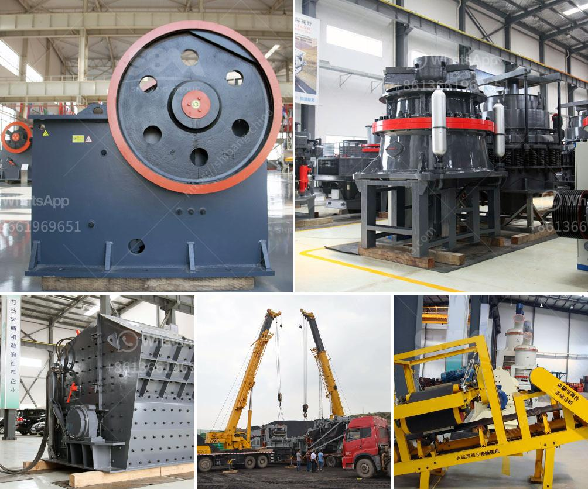

<h3>gold mining equipment manufacturer</h3>
Gold mining has been a vital industry in many countries for centuries, with gold being a prized commodity throughout history. The process of extracting gold from the earth requires immense skill, specialized equipment, and a deep understanding of geological factors. In recent years, the demand for gold has surged, leading to a significant increase in the demand for gold mining equipment.

Gold mining equipment manufacturers play a crucial role in the industry, assisting miners with the set-up and efficient operation of their mining operations. They design and manufacture equipment specifically for gold mining, ensuring that mining activities are carried out safely, efficiently, and with minimal environmental impact.

One prominent gold mining equipment manufacturer is [Company Name]. With over [X] years of experience in the industry, they have developed a reputation for delivering high-quality equipment that meets the ever-changing demands of the mining sector. Their commitment to innovation, safety, and customer satisfaction has made them a trusted partner to many gold mining companies globally.

[Company Name] offers a wide range of equipment suitable for various types of gold mining operations. From exploration to extraction, they provide machines and tools specifically designed to handle the complexities of mining in different terrains and conditions. Some of their flagship products include:

1. [Product 1]: This equipment is designed for efficient exploration of potential gold deposits. It enables miners to accurately identify and assess the viability of gold-rich areas, saving both time and resources.

2. [Product 2]: Used during the extraction process, this equipment assists miners in efficiently removing gold from the ground. It incorporates state-of-the-art technology to maximize the recovery of gold while minimizing waste and environmental impact.

3. [Product 3]: Designed for gold mining in rivers and streams, this equipment allows miners to extract gold from water bodies effectively. Its specialized features ensure that minimal damage is caused to the surrounding ecosystem.

In addition to their cutting-edge equipment, [Company Name] also provides comprehensive after-sales support and maintenance services. They understand that keeping mining equipment in optimal working condition is crucial to ensuring uninterrupted operations. Their team of skilled technicians is readily available to assist with repairs, maintenance, and troubleshooting, minimizing downtime and enhancing productivity.

Environmental responsibility is a key aspect of [Company Name]'s philosophy. They are committed to developing equipment that minimizes the negative impact of gold mining on ecosystems. By implementing innovative technological solutions, their equipment reduces water and energy consumption, prevents soil erosion, and helps minimize the release of harmful substances into the environment.

In conclusion, gold mining equipment manufacturers like [Company Name] play an integral role in the gold mining industry. Their expertise, innovation, and commitment to environmental responsibility enable miners to carry out their operations safely, efficiently, and sustainably. As the demand for gold continues to rise, the collaboration between mining companies and equipment manufacturers becomes even more critical in ensuring the responsible extraction of this coveted metal.
<h3>Contact us</h3><ul><li><strong>Whatsapp:&nbsp;<a href="https://wa.me/8613661969651">+8613661969651</a></strong></li><li><a href="https://swt.shibang-china.com/?git&amp;zhl&amp;gold mining equipment manufacturer"><strong>Online Service(chat now)</strong></a></li></ul><h3>Related</h3><ul><li><a href='two pass roller mill.md'>two pass roller mill</a></li><li><a href='how many kg in 1 cubic feet of 20mm crusher stone.md'>how many kg in 1 cubic feet of 20mm crusher stone</a></li><li><a href='jaw crusher in dubai.md'>jaw crusher in dubai</a></li><li><a href='price of stone crusher plant.md'>price of stone crusher plant</a></li><li><a href='quotation for stone crusher.md'>quotation for stone crusher</a></li></ul>