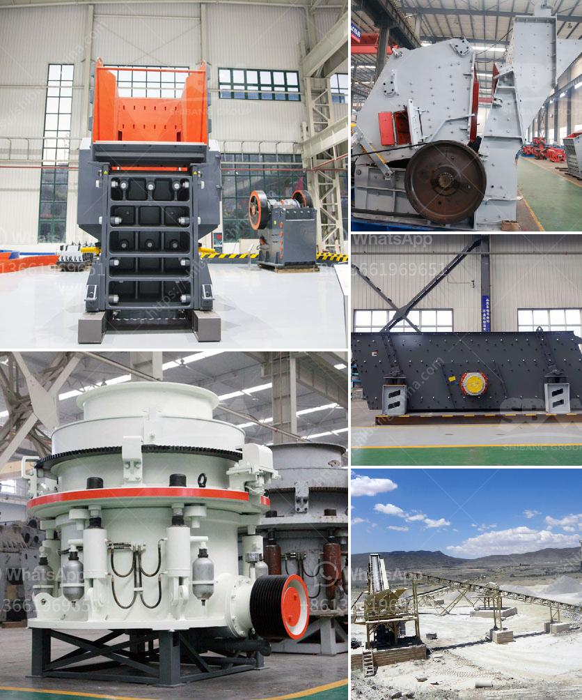

<h3>gold mining equipment stamp mill</h3>
The gold mining equipment stamp mill is a mechanical crusher used for crushing ore samples into a fine powder. It was first invented in ancient Rome in the 1st century AD by a man named Smith. It is used in the mining industry to separate valuable metals from rocks by grinding the rocks into powder.

The stamp mill consists of a heavy and sturdy piston, which is attached to a long wooden handle. The piston is then lifted up and dropped repeatedly onto the rocks, crushing them in the process. This method of crushing rocks was highly effective in extracting gold from its ores.

In the early years of gold mining, stamp mills were used by miners in the California gold rush. They were heavy, cumbersome, and required a lot of manpower to operate. However, they were able to crush large quantities of ore quickly and efficiently, making them indispensable tools for extractors searching for the precious metal.

The stamp mill was mainly used in hard rock mining operations. Miners would usually dig deep underground to extract gold-rich ores from veins or lodes. These ores were then brought to the surface and crushed by the stamp mill to release the gold particles. The crushed material was then processed further using other extraction methods, such as gravity separation or chemical leaching, to separate the gold from the remaining rock.

The stamp mill played a crucial role in the development of the mining industry. It allowed miners to process larger quantities of ore and extract gold from lower-grade deposits that were not economically viable with other methods. This led to a significant increase in gold production, making the stamp mill a vital piece of equipment for miners worldwide.

Over time, advancements in technology led to the development of more efficient crushing methods, such as the jaw crusher or the ball mill. These newer technologies replaced the stamp mill in most mining operations, as they were more reliable, faster, and required less maintenance. However, stamp mills can still be found in some small-scale mining operations or museums, where they serve as a reminder of the early history of gold mining.

In conclusion, the gold mining equipment stamp mill played a crucial role in the development of the mining industry. It allowed miners to crush large quantities of ore quickly and efficiently, increasing gold production worldwide. Although it has been largely replaced by newer crushing technologies, the stamp mill remains an important piece of mining history.
<h3>Contact us</h3><ul><li><strong>Whatsapp:&nbsp;<a href="https://wa.me/8613661969651">+8613661969651</a></strong></li><li><a href="https://swt.shibang-china.com/?git&amp;zhl&amp;gold mining equipment stamp mill"><strong>Online Service(chat now)</strong></a></li></ul><h3>Related</h3><ul><li><a href='crusher dust washing machines.md'>crusher dust washing machines</a></li><li><a href='barite mining process.md'>barite mining process</a></li><li><a href='stone crusher fairs.md'>stone crusher fairs</a></li><li><a href='hand gold washing plant sale.md'>hand gold washing plant sale</a></li><li><a href='sand mining equipment manufacturers in south africa.md'>sand mining equipment manufacturers in south africa</a></li></ul>