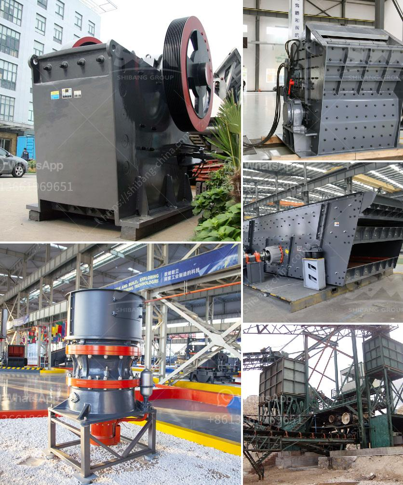

<h3>gold ore 300 550tph cs cone crusher for sale</h3>
Gold ore is a valuable mineral resource that is often mined and processed to extract the precious metal. It is widely used in various industries such as jewelry, electronics, and dentistry. To efficiently extract gold from the ore, it needs to be crushed into smaller particles before being processed further.

One popular equipment used for gold ore crushing is the CS cone crusher. This machine is built with advanced technology and has the ability to process gold ore efficiently. The CS cone crusher is able to crush gold ore to a smaller size than other crushers, ensuring a higher recovery rate of the precious metal.

With a capacity of 300-550tph, the CS cone crusher is ideal for large-scale gold ore processing. Its sturdy construction and durable components ensure reliable operation and low maintenance requirements. Additionally, the adjustable crushing chamber allows for precise control of the particle size, providing consistent results and optimized gold recovery.

In addition to its crushing capabilities, the CS cone crusher also offers other advantages. It features a hydraulic system that allows for easy and convenient adjustment of the crusher settings, ensuring optimal performance. The machine is also equipped with a reliable lubrication system, preventing excessive wear and extending the lifespan of the components.

For those looking to invest in gold ore processing, the CS cone crusher is a viable option. Its high capacity and efficient crushing capabilities make it a valuable asset in any gold mining operation. With a wide range of features designed to enhance performance, this machine is sure to deliver impressive results.

In conclusion, the CS cone crusher is a reliable and efficient machine for crushing gold ore. With its impressive capacity and advanced technology, it is a valuable asset for any gold mining operation. Whether used in large-scale processing plants or small-scale mining ventures, this crusher is sure to deliver optimal results, ensuring maximum recovery of the precious metal.
<h3>Contact us</h3><ul><li><strong>Whatsapp:&nbsp;<a href="https://wa.me/8613661969651">+8613661969651</a></strong></li><li><a href="https://swt.shibang-china.com/?git&amp;zhl&amp;gold ore 300 550tph cs cone crusher for sale"><strong>Online Service(chat now)</strong></a></li></ul><h3>Related</h3><ul><li><a href='slag processing plant manufacturers in chile.md'>slag processing plant manufacturers in chile</a></li><li><a href='used 500 tph stone crusher prices.md'>used 500 tph stone crusher prices</a></li><li><a href='controlling parameter of impact crusher.md'>controlling parameter of impact crusher</a></li><li><a href='harga mesin pemecah batu kapasitas satu ton.md'>harga mesin pemecah batu kapasitas satu ton</a></li><li><a href='sewa mobile stone crusher di indonesia.md'>sewa mobile stone crusher di indonesia</a></li></ul>