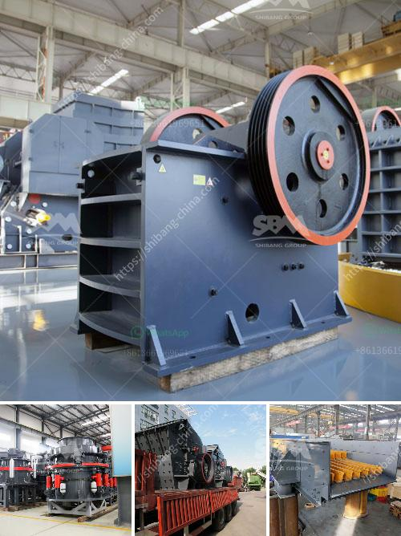

<h3>gold ore processing nigeria</h3>
Gold, a precious and valuable resource, has been mined and processed for centuries. Its abundance and aesthetic appeal make it highly sought after worldwide. Nigeria, a beautiful West African country, is known for its vast mineral resources including gold. In this article, we will explore the process of gold ore processing in Nigeria.

Gold ore processing involves various techniques and processes to extract gold from the ground and convert it into a usable form. This process typically begins with the mining of gold ore from either open-pit or underground mines. Nigerian miners dig the ore manually using simple tools and then break them down using crushers. This initial process releases the gold particles from the surrounding rock material.

After the ore has been crushed, it is then milled to a fine powder using various milling machines. The milled ore is then subjected to a series of chemical processes that separate the gold from other valuable minerals and impurities. One of the most commonly used techniques is cyanidation, which involves the use of a weak cyanide solution to dissolve the gold particles.

The cyanide solution then undergoes a chemical reaction with the gold to form a soluble compound called gold cyanide. The gold cyanide is then extracted from the solution using a method called carbon adsorption. This involves passing the cyanide solution through activated carbon, which has a high affinity for gold. The gold particles stick to the carbon, while the impurities pass through.

Once the gold particles have been adsorbed onto the carbon, they are then eluted or washed off the carbon using a strong acidic solution. This process allows for the recovery of gold in a concentrated form. The concentrated gold is then smelted, transforming it into a pure, solid gold bar that can be easily traded or fashioned into jewelry.

In Nigeria, gold ore processing is predominantly done by artisanal and small-scale miners, who lack the proper equipment and machinery to extract gold efficiently and safely. These miners are exposed to numerous health hazards due to the use of mercury, a toxic substance used in the processing of gold.

To combat these challenges, the Nigerian government and international organizations are working together to promote safe and environmentally friendly gold ore processing methods. This includes the introduction of modern equipment and techniques that minimize the use of mercury and promote responsible mining practices.

In conclusion, gold ore processing in Nigeria is a complex and challenging process that requires proper planning, investment, and adherence to health and safety standards. It is an essential part of Nigeria's economy and can contribute significantly to its development. By promoting responsible and sustainable mining practices, Nigeria can harness the full potential of its gold resources while protecting the environment and the health of its people.
<h3>Contact us</h3><ul><li><strong>Whatsapp:&nbsp;<a href="https://wa.me/8613661969651">+8613661969651</a></strong></li><li><a href="https://swt.shibang-china.com/?git&amp;zhl&amp;gold ore processing nigeria"><strong>Online Service(chat now)</strong></a></li></ul><h3>Related</h3><ul><li><a href='buy quarry machine from europe.md'>buy quarry machine from europe</a></li><li><a href='crushers and feeders in south africa.md'>crushers and feeders in south africa</a></li><li><a href='stone crusher plant project feasibility study.md'>stone crusher plant project feasibility study</a></li><li><a href='crushers for recycling machine uae.md'>crushers for recycling machine uae</a></li><li><a href='mobile jaw crusher for sale.md'>mobile jaw crusher for sale</a></li></ul>