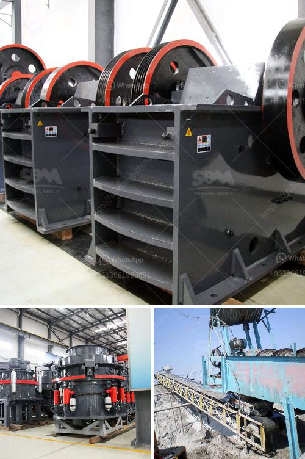

<h3>gold processing crusher</h3>
Gold mining is a major industry in many countries around the world. Historically, gold has been highly valued and sought after due to its rarity and unique properties. It is widely used in various industries, including electronics, jewelry, and dentistry. However, before gold can be used for these purposes, it needs to go through a process known as gold processing. One critical component of this process is the gold processing crusher.

Crushing is the first step in the gold processing line. In operation, the raw gold ore is fed into the crusher, which consists of a high-speed rotating rotor with a hammer. The ore is repeatedly impacted by the hammer until it is crushed to the desired size and discharged through a screen. The crushed material is then further processed through a series of stages to extract the gold.

The gold processing crusher plays a crucial role in the gold ore processing plants. It is widely used in the crushing of various ores and bulk materials, such as granite, limestone, and concrete. Its high crushing rate and large capacity have made it the favorite choice for many mine owners and operators. Additionally, the crusher is known for its low energy consumption and high efficiency, making it a cost-effective solution for gold processing.

One of the primary benefits of using a gold processing crusher is its ability to crush the ore into smaller particles. This increases the surface area of the ore, allowing for easier extraction of gold particles during subsequent processing stages. By breaking down the ore into smaller sizes, the crusher ensures maximum exposure of gold particles to the leaching solution or other extraction methods, resulting in higher gold recovery rates.

Furthermore, the gold processing crusher is designed to handle ores of various hardness levels. This versatility is essential as different gold deposits can vary widely in terms of their ore hardness. The crusher's adjustable settings allow operators to optimize the crushing process for maximum recovery of gold, regardless of the ore's hardness.

Another crucial aspect of the gold processing crusher is its reliability. Gold processing operations often run 24/7, and any equipment downtime can significantly impact productivity. Therefore, the crusher is built to withstand high loads and continuous operation without experiencing frequent failures or breakdowns. Its robust construction and high-quality components ensure its durability and longevity, minimizing the downtime and associated costs.

In conclusion, the gold processing crusher is an essential component in the gold ore processing line. Its high crushing rate, large capacity, and low energy consumption make it a valuable tool for extracting gold from its ores. Additionally, its ability to crush the ore into smaller particles maximizes gold recovery rates and enhances overall processing efficiency. Moreover, the crusher's reliability ensures uninterrupted operation, allowing for continuous production in gold processing plants. As the demand for gold continues to grow, the gold processing crusher will remain an integral part of the gold mining industry.
<h3>Contact us</h3><ul><li><strong>Whatsapp:&nbsp;<a href="https://wa.me/8613661969651">+8613661969651</a></strong></li><li><a href="https://swt.shibang-china.com/?git&amp;zhl&amp;gold processing crusher"><strong>Online Service(chat now)</strong></a></li></ul><h3>Related</h3><ul><li><a href='use of talc in fertilizer coating process.md'>use of talc in fertilizer coating process</a></li><li><a href='ultrafine grinder mill construction.md'>ultrafine grinder mill construction</a></li><li><a href='alluvial gold mining process.md'>alluvial gold mining process</a></li><li><a href='hydro classifier silica sand.md'>hydro classifier silica sand</a></li><li><a href='services of a crushing machine.md'>services of a crushing machine</a></li></ul>