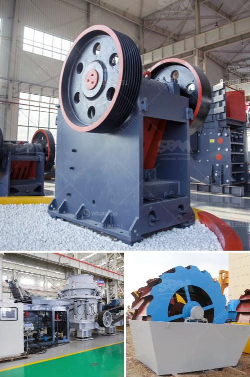

<h3>gold processing plant equipment price</h3>
Gold processing plant equipment plays an important role in the gold processing industry. Gold is one of the most valuable metals found in the earth's crust. It is used in various industries such as jewelry, electronics, medicine, and dentistry. To extract gold from its ore, substantial equipment is required at different stages of the gold processing plant.

The price of gold processing plant equipment depends on several factors such as the type and size of the equipment, the capacity of the plant, and the location of the plant. Generally, larger plants with higher processing capacities require more expensive equipment.

Some of the essential equipment used in a gold processing plant includes crushers, conveyors, grinding mills, flotation machines, and gold smelting furnaces. Crushers are used to break down the gold ore into smaller pieces for further processing. Conveyors transport the crushed ore to various stages of the processing plant. Grinding mills are used to grind the crushed ore into a fine powder.

Flotation machines are commonly used in gold processing plants to separate gold particles from other minerals. These machines utilize the difference in surface properties of gold and other minerals to separate them. By adding certain chemicals, gold particles are made hydrophobic and attach to air bubbles, which are then separated from other minerals.

Gold smelting furnaces are used to melt gold into a more purified form. These furnaces can reach extremely high temperatures, allowing impurities to be removed and leaving behind pure gold. This purified gold is then further processed into various forms such as bars or ingots.

The price of gold processing plant equipment varies depending on the size and capacity of the equipment. Smaller plants with lower capacities may have lower equipment costs compared to larger plants. Additionally, the location of the plant can also impact the equipment price due to factors such as transportation and installation costs.

In recent years, the price of gold has been volatile, leading to fluctuations in the gold processing plant equipment price. Global economic conditions, political stability, and supply and demand factors can all influence the price of gold. As a result, the equipment price can vary over time.

When considering the price of gold processing plant equipment, it is crucial to evaluate the quality and reliability of the equipment. Investing in high-quality equipment can ensure the smooth and efficient operation of the plant, minimizing downtime and maximizing production.

Some reputable manufacturers and suppliers offer a wide range of gold processing plant equipment with varying prices. It is advisable to compare prices and quality from different suppliers to make an informed decision. Additionally, consulting industry experts or engaging the services of a professional consultant can assist in determining the most suitable equipment for a specific gold processing plant.

In conclusion, the price of gold processing plant equipment depends on various factors such as the type and size of the equipment, plant capacity, and location. Investing in high-quality equipment is essential for efficient gold processing plant operations. Consequently, it is crucial to evaluate different suppliers and consider the long-term benefits and reliability of the equipment.
<h3>Contact us</h3><ul><li><strong>Whatsapp:&nbsp;<a href="https://wa.me/8613661969651">+8613661969651</a></strong></li><li><a href="https://swt.shibang-china.com/?git&amp;zhl&amp;gold processing plant equipment price"><strong>Online Service(chat now)</strong></a></li></ul><h3>Related</h3><ul><li><a href='crushers of crushers.md'>crushers of crushers</a></li><li><a href='crushed stone prices per ton.md'>crushed stone prices per ton</a></li><li><a href='vertical grinding machine for foundry.md'>vertical grinding machine for foundry</a></li><li><a href='quartz powder manufacturers in india.md'>quartz powder manufacturers in india</a></li><li><a href='mini gold ore wash plant plans.md'>mini gold ore wash plant plans</a></li></ul>